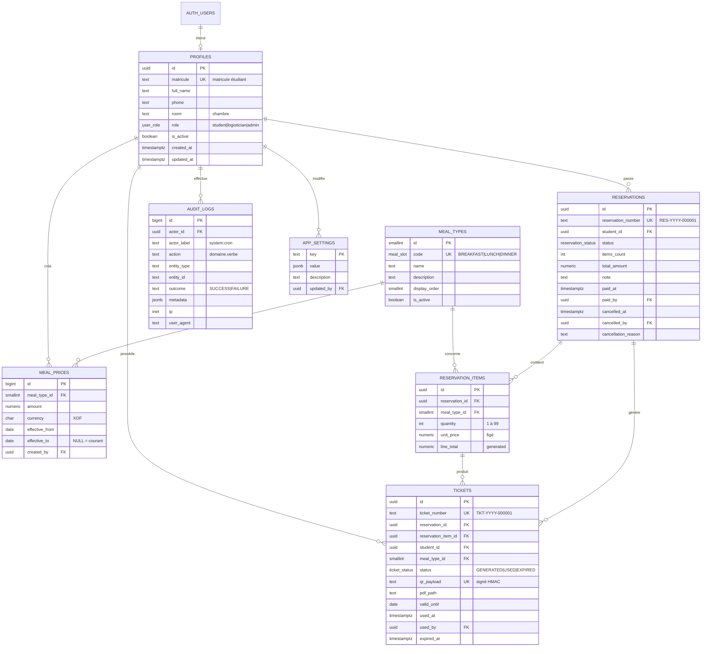

# Étape 3 — Base de données

PostgreSQL / Supabase. Tout ce qui suit est implémenté dans `sql/` et exécutable dans l'ordre.

## 3.1 Diagramme ER



## 3.2 Fichiers SQL

| Fichier | Contenu |
|---|---|
| `sql/00_extensions_enums.sql` | `pgcrypto`, `btree_gist`, 4 enum, 2 séquences de numérotation |
| `sql/01_tables.sql` | 8 tables + contraintes + index |
| `sql/02_functions_triggers.sql` | Helpers d'autorisation, numérotation, garde-fous, 4 opérations métier |
| `sql/03_rls.sql` | RLS activée + 18 policies |
| `sql/04_views.sql` | 6 vues + 1 vue matérialisée |
| `sql/05_seed.sql` | Repas, paramètres par défaut |
| `sql/06_storage.sql` | Bucket `tickets`, policies, crons |

Ordre d'exécution : `00 → 01 → 02 → 03 → 04 → 05 → 06`.

## 3.3 Correspondance règles métier → implémentation

| Règle | Implémentation SQL |
|---|---|
| 1. ≥ 1 repas, quantité ≥ 1 | `check (quantity between 1 and 99)` + `unique (reservation_id, meal_type_id)` (`01_tables.sql:127`) |
| 2. Prix depuis la base, total recalculé | Table `meal_prices`, trigger `fn_sync_reservation_totals` (`02_functions_triggers.sql:196`) |
| 3. `unit_price` figé | Colonne `unit_price` dans `reservation_items`, copiée à la création, jamais modifiée |
| 4. L'étudiant ne confirme jamais | Trigger `fn_guard_reservation_update` : `PAYMENT_CONFIRM_FORBIDDEN` (`02_functions_triggers.sql:246`) |
| 5. `PENDING_PAYMENT → PAID/CANCELLED`, sans retour | Enum + `check` sur dates + `RESERVATION_PAID_FINAL` |
| 6. `GENERATED → USED/EXPIRED`, USED définitif | Enum + `check` + trigger `fn_guard_ticket_update` : `TICKET_USED_FINAL` |
| 7. Un ticket par repas | `fn_confirm_payment` : `cross join generate_series(1, quantity)` → 17 tickets pour 10+5+2 |
| 8. Numéros uniques | Séquences PostgreSQL + `unique` + format vérifié par `check` |
| 9. Confirmation atomique et idempotente | `fn_confirm_payment` : `select ... for update`, drapeau `already_confirmed` au second appel |
| 10. Audit jamais supprimé | Trigger `audit_logs_no_update/no_delete` + `revoke update, delete` + RLS sans policy |

## 3.4 Les quatre opérations métier

Toutes en SQL, `SECURITY DEFINER`, donc inviolables quel que soit le client.

```
fn_confirm_payment(reservation_id, actor_id, validity_days, ip, user_agent) -> jsonb
    • verrou de ligne sur la réservation (deux clics simultanés sérialisés)
    • si déjà PAID  -> renvoie l'état, ne recrée rien  (idempotence)
    • si CANCELLED  -> erreur 23514
    • bascule le statut via un drapeau transactionnel app.payment_confirm
    • insère les tickets (numéro, étudiant, repas, validité)
    • écrit l'audit
    -> le backend complète qr_payload / pdf_path AVANT le commit :
       soit tout est enregistré, soit rien ne l'est.

fn_consume_ticket(ticket_number, actor_id, ip, user_agent) -> jsonb
    • verrou de ligne sur le ticket
    • introuvable / déjà consommé / expiré -> exception + audit en FAILURE
    • GENERATED -> USED, used_at, used_by
    -> le backend vérifie la signature HMAC AVANT cet appel ; la base
       reste le dernier verrou anti-réutilisation.

fn_cancel_reservation(reservation_id, actor_id, reason) -> jsonb
    • refus si PAID (remboursement hors périmètre, gestion manuelle)

fn_expire_tickets(actor_label) -> int
    • GENERATED + valid_until dépassée -> EXPIRED, en un seul ordre SQL
    • appelée par un cron quotidien
```

## 3.5 Verrous anti-fraude posés en base

1. **Doublon de statut** — les colonnes `paid_at`/`paid_by`/`cancelled_at` et `used_at`/`used_by`/`expired_at` sont contraintes par `check` : un ticket `USED` a obligatoirement une date et un opérateur.
2. **Cohérence étudiante** — `tickets` référence `(reservations.id, reservations.student_id)` via une clé étrangère composite : impossible d'attacher un ticket à un autre étudiant que celui de la réservation.
3. **Cohérence repas** — `tickets` référence `(reservation_items.id, reservation_items.meal_type_id)` : un ticket de déjeuner ne peut pas sortir d'une ligne petit-déjeuner.
4. **Montant non falsifiable** — `total_amount` et `items_count` sont recalculés par trigger depuis les lignes ; toute écriture directe est rejetée (`RESERVATION_AMOUNT_IMMUTABLE`).
5. **Prix historisé** — la contrainte d'exclusion `meal_prices_no_overlap_excl` interdit deux périodes de prix qui se chevauchent pour un même repas.
6. **Concurrence** — `select ... for update` dans les deux opérations sensibles ; deux scans simultanés du même QR donnent un succès et un `TICKET_ALREADY_USED`.
7. **Immuabilité** — `audit_logs` : trigger bloquant update/delete, privilèges révoqués, RLS en lecture admin seule.

## 3.6 RLS — qui voit quoi

| Table | Étudiant | Logisticien | Admin |
|---|---|---|---|
| `profiles` | son profil | tous les profils | tous + écriture |
| `meal_types`, `meal_prices` | lecture | lecture | écriture |
| `reservations` | les siennes (créer, annuler) | toutes + encaisser | tout |
| `reservation_items` | les siennes, modifiables si `PENDING_PAYMENT` | toutes | toutes |
| `tickets` | les siens, **lecture seule** | tous | lecture |
| `audit_logs` | — | — | lecture seule |
| `app_settings` | lecture | lecture | écriture |

Le backend FastAPI se connecte en `service_role` (qui contourne la RLS) et applique ses propres permissions : la RLS protège l'accès direct à la base, pas l'API.

## 3.7 Vues disponibles

- `v_current_prices` — prix en vigueur par repas
- `v_pending_payments` — file d'attente d'encaissement, avec temps d'attente
- `v_daily_sales` — chiffre d'affaires et tickets consommés par jour
- `v_sales_by_meal` — ventes et consommations par type de repas
- `v_ticket_stats` — répartition `GENERATED` / `USED` / `EXPIRED`
- `v_student_consumption` — suivi par étudiant
- `mv_monthly_report` — rapport mensuel matérialisé (rafraîchi par cron)

Toutes en `security_invoker = true` : un étudiant qui interroge une vue ne voit que ses propres lignes.

## 3.8 Hypothèses retenues (issues de l'étape 1.6)

| Sujet | Décision |
|---|---|
| Validité d'un ticket | 30 jours après paiement, paramétrable (`tickets.validity_days`), non lié à un jour de repas |
| Expiration | cron quotidien `fn_expire_tickets()` |
| Annulation | `PENDING_PAYMENT` uniquement, via `fn_cancel_reservation` |
| Remise à zéro des numéros | `fn_reset_number_sequences()` le 1er janvier |
| Fuseau horaire | `Africa/Abidjan` dans les vues de reporting — à confirmer |
| Devise | XOF (FCFA) — à confirmer |
| Montants des prix | À saisir par l'admin depuis l'écran Tarifs |

## 3.9 Points à valider avant l'étape 4

1. Fuseau horaire et devise : `Africa/Abidjan` / XOF sont-ils corrects ?
2. Validité de 30 jours : faut-il plutôt lier le ticket à une date de repas choisie à la réservation ?
3. Confirmez-vous le modèle « 1 ligne de réservation = 1 type de repas, quantité N, N tickets » ?
4. Souhaitez-vous une table `payments` séparée (montant reçu, monnaie rendue) ou l'encaissement reste-t-il une simple bascule de statut ?
