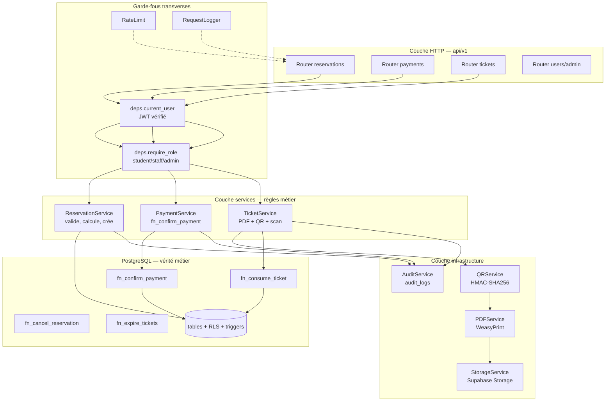

# Étape 4 — Architecture backend (FastAPI)

## 4.1 Principes

1. **Le backend est fin, la base est épaisse.** Toutes les règles métier critiques (statuts, montants, numérotation, idempotence) vivent dans les fonctions SQL de l'étape 3. Le backend orchestre, valide les entrées, génère les PDF et les QR, écrit l'audit.
2. **Aucune règle métier dupliquée.** Si une règle existe en SQL, le backend ne la réimplémente pas : il propage l'exception PostgreSQL telle quelle.
3. **Le backend est le seul client `service_role`.** Aucun secret de base ne sort vers le navigateur.
4. **Tout est asynchrone.** SQLAlchemy 2.0 async + `asyncpg`.

## 4.2 Dépendances

```
# requirements.txt
fastapi==0.115.*
uvicorn[standard]==0.32.*
sqlalchemy[asyncio]==2.0.*
asyncpg==0.30.*
alembic==1.14.*
pydantic==2.9.*
pydantic-settings==2.6.*
python-jose[cryptography]==3.3.*      # vérification JWT Supabase (JWKS)
httpx==0.28.*
weasyprint==63.*                      # HTML -> PDF
segno==1.6.*                          # QR code
python-multipart==0.0.*
Pillow==11.*                          # images signature/cachet
jinja2==3.1.*
slowapi==0.1.*                        # rate limiting
structlog==24.*                       # logs JSON
pytest==8.* / pytest-asyncio / anyio
```

## 4.3 Structure du projet

```
backend/
├── app/
│   ├── main.py                  # usine d'application, lifespan, middlewares
│   ├── config.py                # Settings pydantic (env, jamais de secret en dur)
│   ├── database.py              # engine async, session factory, base declarative
│   │
│   ├── models/                  # SQLAlchemy, miroir exact du schéma SQL
│   │   ├── __init__.py          # importe tous les modèles ( Alembic )
│   │   ├── profile.py
│   │   ├── meal.py              # MealType, MealPrice
│   │   ├── reservation.py       # Reservation, ReservationItem
│   │   ├── ticket.py
│   │   ├── audit.py             # AuditLog
│   │   └── settings.py          # AppSetting
│   │
│   ├── schemas/                 # Pydantic : requêtes et réponses
│   │   ├── common.py            # Page, Money, Message
│   │   ├── auth.py              # TokenPayload, CurrentUser
│   │   ├── meal.py              # MealOut, PriceOut
│   │   ├── reservation.py       # ReservationCreate, ReservationOut, ...
│   │   ├── ticket.py            # TicketOut, ConsumeResult, ...
│   │   ├── payment.py           # ConfirmPaymentIn/Out
│   │   ├── report.py            # DailySales, DashboardStats
│   │   └── settings.py
│   │
│   ├── api/
│   │   ├── deps.py              # dépendances : session, current_user, rôles
│   │   ├── router.py            # agrégateur /api/v1
│   │   └── v1/
│   │       ├── auth.py          # /auth/me, /auth/token
│   │       ├── meals.py         # repas + prix
│   │       ├── reservations.py  # cycle de vie complet
│   │       ├── payments.py      # encaissement
│   │       ├── tickets.py       # liste, PDF, scan
│   │       ├── users.py         # gestion des comptes (admin)
│   │       ├── settings.py      # tarifs, signature, cachet
│   │       ├── reports.py       # statistiques
│   │       └── audit.py         # consultation du journal (admin)
│   │
│   ├── services/                # RÈGLES MÉTIER, une classe par domaine
│   │   ├── auth_service.py      # vérif JWT, résolution du profil
│   │   ├── reservation_service.py
│   │   ├── payment_service.py   # appelle fn_confirm_payment
│   │   ├── ticket_service.py    # appel fn_consume_ticket, PDF, QR
│   │   ├── pdf_service.py       # template Jinja -> WeasyPrint
│   │   ├── qr_service.py        # payload + signature HMAC
│   │   ├── storage_service.py   # Supabase Storage (upload, URL signée)
│   │   ├── audit_service.py     # écriture et lecture d'audit_logs
│   │   └── report_service.py    # agrégations pour les tableaux de bord
│   │
│   ├── core/
│   │   ├── security.py          # HMAC, constant-time compare, hachage
│   │   ├── errors.py            # exceptions métier -> HTTP
│   │   ├── exceptions.py        # handlers globaux
│   │   ├── logging.py           # structlog
│   │   ├── ratelimit.py
│   │   └── pagination.py
│   │
│   ├── templates/
│   │   ├── ticket.html          # gabarit d'un ticket
│   │   ├── ticket_sheet.html    # feuille de N tickets
│   │   └── receipt.html         # reçu de paiement
│   │
│   └── static/                  # polices, logo de secours
│
├── migrations/                   # Alembic (versions du schéma de l'étape 3)
│   ├── env.py
│   └── versions/0001_initial_schema.py
│
├── tests/
│   ├── conftest.py              # base de test, fixtures, client async
│   ├── test_reservations.py
│   ├── test_payments.py         # idempotence, double clic
│   ├── test_tickets.py          # anti-réutilisation, expiration
│   ├── test_rls.py              # un étudiant ne voit pas l'autre
│   └── test_security.py         # QR falsifié rejeté
│
├── Dockerfile
├── alembic.ini
└── requirements.txt
```

## 4.4 Diagramme des couches



Règle de dépendance : `api → services → infrastructure`. Jamais l'inverse, jamais `api → infrastructure` en direct.

## 4.5 Configuration

```python
# app/config.py
from functools import lru_cache
from pydantic_settings import BaseSettings, SettingsConfigDict

class Settings(BaseSettings):
    model_config = SettingsConfigDict(env_file=".env", extra="ignore")

    app_name: str = "Resto Smart API"
    environment: str = "development"          # development | staging | production
    api_prefix: str = "/api/v1"

    # Supabase
    supabase_url: str
    supabase_anon_key: str
    supabase_service_role_key: str          # JAMAIS exposé au frontend
    supabase_jwt_secret: str                # ou supabase_jwks_url
    database_url: str                       # postgresql+asyncpg://...

    # QR / anti-fraude
    qr_secret: str                          # clé HMAC, hors dépôt git
    qr_secret_version: int = 1

    # Tickets
    ticket_validity_days: int = 30
    pdf_per_page: int = 4

    # Stockage
    storage_bucket: str = "tickets"
    signed_url_ttl_seconds: int = 300

    # Divers
    cors_origins: list[str] = ["http://localhost:3000"]
    rate_limit_default: str = "100/minute"

@lru_cache
def get_settings() -> Settings:
    return Settings()
```

`.env` est dans `.gitignore`. En production, les valeurs viennent des variables d'environnement de Railway/Render.

## 4.6 Modèles SQLAlchemy (extraits)

Les modèles reflètent exactement le schéma de l'étape 3 — pas de logique dedans.

```python
# app/models/reservation.py
import uuid
from datetime import datetime
from decimal import Decimal
from enum import Enum as PyEnum
from sqlalchemy import ForeignKey, Integer, Numeric, String, Text
from sqlalchemy.orm import Mapped, mapped_column, relationship
from sqlalchemy.dialects.postgresql import UUID, TIMESTAMP
from app.database import Base

class ReservationStatus(str, PyEnum):
    PENDING_PAYMENT = "PENDING_PAYMENT"
    PAID = "PAID"
    CANCELLED = "CANCELLED"

class Reservation(Base):
    __tablename__ = "reservations"

    id: Mapped[uuid.UUID] = mapped_column(UUID(as_uuid=True), primary_key=True, default=uuid.uuid4)
    reservation_number: Mapped[str] = mapped_column(String(20), unique=True, nullable=False)
    student_id: Mapped[uuid.UUID] = mapped_column(UUID(as_uuid=True), ForeignKey("profiles.id"), nullable=False)
    status: Mapped[ReservationStatus] = mapped_column(
        Enum(ReservationStatus, name="reservation_status", create_type=False),  # l'enum existe déjà
        nullable=False, default=ReservationStatus.PENDING_PAYMENT,
    )
    items_count: Mapped[int] = mapped_column(Integer, nullable=False, default=0)
    total_amount: Mapped[Decimal] = mapped_column(Numeric(12, 2), nullable=False, default=Decimal("0"))
    note: Mapped[str | None] = mapped_column(Text)
    paid_at: Mapped[datetime | None] = mapped_column(TIMESTAMP(timezone=True))
    paid_by: Mapped[uuid.UUID | None] = mapped_column(UUID(as_uuid=True), ForeignKey("profiles.id"))
    cancelled_at: Mapped[datetime | None] = mapped_column(TIMESTAMP(timezone=True))
    cancelled_by: Mapped[uuid.UUID | None] = mapped_column(UUID(as_uuid=True), ForeignKey("profiles.id"))
    cancellation_reason: Mapped[str | None] = mapped_column(Text)
    created_at: Mapped[datetime] = mapped_column(TIMESTAMP(timezone=True), server_default=func.now())
    updated_at: Mapped[datetime] = mapped_column(TIMESTAMP(timezone=True), server_default=func.now())

    items: Mapped[list["ReservationItem"]] = relationship(back_populates="reservation", cascade="all, delete-orphan")
    student: Mapped["Profile"] = relationship(foreign_keys=[student_id])
    tickets: Mapped[list["Ticket"]] = relationship(back_populates="reservation")
```

```python
# app/models/reservation.py (suite)
class ReservationItem(Base):
    __tablename__ = "reservation_items"

    id: Mapped[uuid.UUID] = mapped_column(UUID(as_uuid=True), primary_key=True, default=uuid.uuid4)
    reservation_id: Mapped[uuid.UUID] = mapped_column(UUID(as_uuid=True), ForeignKey("reservations.id", ondelete="CASCADE"), nullable=False)
    meal_type_id: Mapped[int] = mapped_column(Integer, ForeignKey("meal_types.id"), nullable=False)
    quantity: Mapped[int] = mapped_column(Integer, nullable=False)
    unit_price: Mapped[Decimal] = mapped_column(Numeric(10, 2), nullable=False)
    # line_total est GENERATED ALWAYS : en lecture seule
    line_total: Mapped[Decimal] = mapped_column(Numeric(12, 2), Computed("quantity * unit_price"), nullable=False)

    reservation: Mapped[Reservation] = relationship(back_populates="items")
```

## 4.7 Services

### ReservationService

```python
class ReservationService:
    def __init__(self, db: AsyncSession, actor: CurrentUser):
        self.db, self.actor = db, actor

    async def create(self, payload: ReservationCreate) -> ReservationOut:
        """Règles 1, 2 et 3 : les prix viennent de la base, le total est recalculé."""
        async with self.db.begin():                      # une transaction
            prices = await self._load_prices([i.meal_type_id for i in payload.items])

            missing = {i.meal_type_id for i in payload.items} - set(prices)
            if missing:
                raise BusinessError("MEAL_NOT_FOUND", f"Repas inconnus : {sorted(missing)}", 404)

            reservation = Reservation(student_id=self.actor.id, note=payload.note)
            self.db.add(reservation)
            await self.db.flush()                        # attribue l'id, numéro par trigger

            for item in payload.items:
                self.db.add(ReservationItem(
                    reservation_id=reservation.id,
                    meal_type_id=item.meal_type_id,
                    quantity=item.quantity,
                    unit_price=prices[item.meal_type_id],   # figé ici, à jamais
                ))

            await self.db.flush()
            await self.db.refresh(reservation, ["items", "total_amount", "items_count"])
            await self.audit("reservation.create", reservation.reservation_number)
        return ReservationOut.model_validate(reservation)

    async def cancel(self, reservation_id: UUID, reason: str) -> ReservationOut:
        """Hypothèse 1.6 : annulation possible tant que PENDING_PAYMENT."""
        result = await self.db.execute(
            text("select * from public.fn_cancel_reservation(:id, :actor, :reason)"),
            {"id": reservation_id, "actor": self.actor.id, "reason": reason},
        )
        return ReservationOut.model_validate_json(result.scalar_one())
```

### PaymentService — l'opération la plus sensible

```python
class PaymentService:
    """Règle 9 : atomique et idempotente. Règle 4 : jamais l'étudiant."""

    async def confirm(self, reservation_id: UUID) -> ConfirmPaymentOut:
        await self.require_staff()                       # logisticien ou admin

        # 1. Bascule de statut + création des tickets, en base, atomiquement
        row = await self.db.execute(text("""
            select * from public.fn_confirm_payment(:id, :actor, :days, :ip, :ua)
        """), {...})
        data = json.loads(row.scalar_one())

        if data["already_confirmed"]:
            return ConfirmPaymentOut(**data, pdf_urls=await self._existing_pdfs(data["reservation_id"]))

        # 2. Dans la MÊME transaction : signature QR + PDF + upload
        async with self.db.begin():
            tickets = await self._load_generated_tickets(data["reservation_id"])
            for t in tickets:
                t.qr_payload = self.qr.sign(t.ticket_number)      # HMAC
                pdf = await self.pdf.render(t)                    # HTML -> PDF
                t.pdf_path = await self.storage.upload(pdf, t)    # Storage
            await self.audit("payment.confirm", data["reservation_number"])

        # 3. Si une étape échoue -> rollback complet : aucun ticket orphelin
        return ConfirmPaymentOut(**data, pdf_urls=[...])
```

L'atomicité vient du fait que la signature, le PDF et l'upload ont lieu **avant le commit**. Un échec réseau vers Storage annule aussi la bascule de statut.

### TicketService — scan et consommation

```python
class TicketService:
    async def consume(self, qr_payload: str) -> ConsumeResult:
        # 1. Vérification cryptographique AVANT tout accès base
        ticket_number = self.qr.verify(qr_payload)      # lève QRInvalid (401)
        if ticket_number is None:
            raise BusinessError("QR_INVALID", "QR non reconnu ou falsifié", 401)

        # 2. Consommation atomique : la base refuse les doubles scans
        try:
            row = await self.db.execute(text(
                "select * from public.fn_consume_ticket(:num, :actor, :ip, :ua)"), {...})
        except asyncpg.exceptions.RaiseError as exc:
            raise pg_error_to_http(exc)                 # TICKET_ALREADY_USED -> 409

        return ConsumeResult.model_validate_json(row.scalar_one())
```

### QRService

```python
class QRService:
    """QR signé : impossible de fabriquer un ticket valide sans la clé serveur."""
    def sign(self, ticket_number: str) -> str:
        mac = hmac.new(self.settings.qr_secret.encode(), ticket_number.encode(), hashlib.sha256)
        return f"{ticket_number}.{self.settings.qr_secret_version}.{mac.hexdigest()[:16]}"

    def verify(self, payload: str) -> str | None:
        try:
            number, version, mac = payload.rsplit(".", 2)
        except ValueError:
            return None
        if int(version) != self.settings.qr_secret_version:
            return None
        expected = self.sign(number).rsplit(".", 1)[1]
        return number if hmac.compare_digest(mac, expected) else None   # comparaison à temps constant
```

## 4.8 Authentification et permissions

```python
# app/api/deps.py
async def current_user(credentials=Security(HTTPBearer())) -> CurrentUser:
    """Vérifie le JWT Supabase, puis charge le profil applicatif."""
    claims = await auth_service.verify_jwt(credentials.credentials)   # JWKS + exp + aud
    profile = await auth_service.load_profile(claims["sub"])
    if not profile or not profile.is_active:
        raise Unauthorized("Compte inconnu ou désactivé")
    return CurrentUser(id=profile.id, role=profile.role, matricule=profile.matricule)

def require_role(*roles: UserRole):
    async def guard(user: CurrentUser = Depends(current_user)) -> CurrentUser:
        if user.role not in roles:
            raise Forbidden(f"Rôle requis : {[r.value for r in roles]}")
        return user
    return guard

require_student  = require_role(UserRole.STUDENT)
require_staff    = require_role(UserRole.LOGISTICIAN, UserRole.ADMIN)
require_admin    = require_role(UserRole.ADMIN)
```

| Route | Étudiant | Logisticien | Admin |
|---|---|---|---|
| `POST /reservations` | oui, pour lui | oui | oui |
| `GET /reservations/mine` | oui | oui | oui |
| `GET /reservations` (toutes) | — | oui | oui |
| `POST /reservations/{id}/cancel` | les siennes, `PENDING_PAYMENT` | oui | oui |
| `POST /reservations/{id}/confirm-payment` | **jamais** | oui | oui |
| `GET /tickets/mine` | les siens | oui | oui |
| `GET /tickets/{id}/pdf` | les siens | oui | oui |
| `POST /tickets/consume` | **jamais** | oui | oui |
| `GET /meals`, `GET /prices` | oui | oui | oui |
| `PUT /prices/{meal_id}` | — | — | oui |
| `POST /users` | — | — | oui |
| `PUT /users/{id}` (rôle, activation) | — | — | oui |
| `POST /settings/signature` | — | — | oui |
| `GET /reports/*` | — | oui | oui |
| `GET /audit` | — | — | oui |
| `POST /tickets/expire` (cron) | — | — | cron signé |

La règle 4 (l'étudiant ne confirme jamais son paiement) est donc appliquée **trois fois** : RLS, trigger SQL, dépendance FastAPI.

## 4.9 Gestion des erreurs

### Catalogue

| Code métier | HTTP | Signification |
|---|---|---|
| `AUTH_REQUIRED` | 401 | JWT absent ou invalide |
| `TOKEN_EXPIRED` | 401 | JWT expiré → le frontend rafraîchit |
| `ACCOUNT_DISABLED` | 403 | Compte désactivé par l'admin |
| `ROLE_FORBIDDEN` | 403 | Rôle insuffisant |
| `RESERVATION_NOT_FOUND` | 404 | Réservation inconnue |
| `MEAL_NOT_FOUND` | 404 | Repas ou prix inexistant |
| `TICKET_NOT_FOUND` | 404 | Numéro de ticket inconnu |
| `VALIDATION_ERROR` | 422 | Payload invalide (Pydantic) |
| `RESERVATION_LOCKED` | 409 | Réservation déjà payée ou annulée |
| `PAYMENT_CONFIRM_FORBIDDEN` | 409 | Rôle non autorisé à encaisser |
| `RESERVATION_PAID_FINAL` | 409 | Retour arrière depuis `PAID` interdit |
| `RESERVATION_CANCELLED` | 409 | Réservation annulée, non encaissable |
| `TICKET_ALREADY_USED` | 409 | Ticket déjà consommé (double scan) |
| `TICKET_EXPIRED` | 410 | Ticket périmé |
| `TICKET_USED_FINAL` | 409 | Ticket `USED` non modifiable |
| `QR_INVALID` | 401 | Signature HMAC invalide → fraude |
| `PRICE_PERIOD_OVERLAP` | 409 | Nouveau prix qui chevauche l'existant |
| `STORAGE_UPLOAD_FAILED` | 502 | Échec d'envoi du PDF |
| `RATE_LIMITED` | 429 | Trop de requêtes |
| `INTERNAL_ERROR` | 500 | Erreur inattendue (journalisée, jamais exposée) |

### Traduction des exceptions PostgreSQL

```python
# app/core/errors.py
PG_ERROR_MAP = {
    "RESERVATION_LOCKED":        (409, "RESERVATION_LOCKED"),
    "RESERVATION_PAID_FINAL":    (409, "RESERVATION_PAID_FINAL"),
    "RESERVATION_CANCELLED":     (409, "RESERVATION_CANCELLED"),
    "PAYMENT_CONFIRM_FORBIDDEN": (409, "PAYMENT_CONFIRM_FORBIDDEN"),
    "TICKET_ALREADY_USED":       (409, "TICKET_ALREADY_USED"),
    "TICKET_EXPIRED":            (410, "TICKET_EXPIRED"),
    "TICKET_USED_FINAL":         (409, "TICKET_USED_FINAL"),
    "TICKET_NOT_FOUND":          (404, "TICKET_NOT_FOUND"),
    "RESERVATION_NOT_FOUND":     (404, "RESERVATION_NOT_FOUND"),
    "MEAL_NOT_FOUND":            (404, "MEAL_NOT_FOUND"),
}

def pg_error_to_http(exc: Exception) -> BusinessError:
    message = str(exc.orig)
    code = message.split(":", 1)[0].strip()
    status, biz_code = PG_ERROR_MAP.get(code, (409, "BUSINESS_RULE_VIOLATION"))
    return BusinessError(biz_code, message, status)
```

### Format de réponse

Toujours la même enveloppe, succès comme échec.

```jsonc
// succès
{ "success": true, "data": { "...": "..." }, "meta": { "request_id": "..." } }

// échec
{
  "success": false,
  "error": {
    "code": "TICKET_ALREADY_USED",
    "message": "TKT-2026-000042 a déjà été consommé le 09/10/2026 à 12:14",
    "details": { "ticket_number": "TKT-2026-000042", "used_at": "2026-10-09T12:14:03Z" },
    "request_id": "req_01H..."
  }
}
```

```python
# app/core/exceptions.py
class BusinessError(Exception):
    def __init__(self, code: str, message: str, status: int = 400, details: dict | None = None):
        self.code, self.message, self.status, self.details = code, message, status, details or {}

@app.exception_handler(BusinessError)
async def business_error_handler(request: Request, exc: BusinessError):
    return JSONResponse(status_code=exc.status, content={
        "success": False,
        "error": {"code": exc.code, "message": exc.message,
                  "details": exc.details, "request_id": request.state.request_id},
    })

@app.exception_handler(Exception)
async def unhandled_handler(request: Request, exc: Exception):
    log.error("unhandled_error", exc_info=exc, path=request.url.path)   # trace complète en interne
    return JSONResponse(status_code=500, content={
        "success": False,
        "error": {"code": "INTERNAL_ERROR",
                  "message": "Une erreur interne est survenue.",      # message neutre à l'extérieur
                  "request_id": request.state.request_id},
    })
```

## 4.10 Middlewares, dans l'ordre

```python
# app/main.py
app.add_middleware(RequestContextMiddleware)   # request_id, horodatage
app.add_middleware(RateLimitMiddleware)        # 100/min global, 10/min sur /tickets/consume
app.add_middleware(SecurityHeadersMiddleware)  # HSTS, X-Content-Type-Options, no-store
app.add_middleware(CORSMiddleware, allow_origins=settings.cors_origins,
                   allow_methods=["GET", "POST", "PUT", "PATCH", "DELETE"],
                   allow_headers=["Authorization", "Content-Type"])
```

- `Cache-Control: no-store` sur **toutes** les réponses : aucun ticket ne doit finir dans un cache.
- Journalisation `structlog` en JSON : `request_id`, `actor_id`, `role`, `action`, `duration_ms`, `status_code`.
- Aucun montant, numéro de ticket ni donnée personnelle dans les logs.

## 4.11 Tâches planifiées

Deux endpoints protégés par un secret partagé, appelés par un cron externe (Supabase `pg_cron` ou Railway Cron) :

```
POST /internal/tickets/expire   -> appelle fn_expire_tickets()
POST /internal/sequences/reset  -> appelle fn_reset_number_sequences() (1er janvier)
```

Ils portent l'en-tête `X-Cron-Secret` et ne sont pas exposés publiquement.

## 4.12 Tests attendus

| Fichier | Ce qui est prouvé |
|---|---|
| `test_reservations.py` | création, prix figés, total recalculé, annulation refusée après paiement |
| `test_payments.py` | double clic → un seul jeu de tickets, second appel `already_confirmed` |
| `test_tickets.py` | double scan rejeté, ticket expiré rejeté, QR falsifié rejeté |
| `test_rls.py` | un étudiant ne lit ni les tickets ni les réservations d'un autre |
| `test_security.py` | étudiant qui tente `confirm-payment` → 409, JWT expiré → 401 |
| `test_audit.py` | chaque opération sensible laisse une trace, aucune modification possible |

## 4.13 Points à valider avant l'étape 5

1. Confirmez-vous le partage des responsabilités : **règles en SQL, orchestration en Python** ? (C'est ce qui rend le système robuste, mais suppose que le SQL de l'étape 3 est figé.)
2. Le backend doit-il aussi exposer les PDF en flux direct (`GET /tickets/{id}/pdf`) en plus des URL signées Supabase ?
3. Souhaitez-vous une route `POST /tickets/{number}/reissue` pour réimprimer un ticket perdu, ou est-ce hors périmètre ?
4. Faut-il un endpoint de recherche étudiant par matricule pour le logisticien (`GET /students?matricule=...`) avant de créer une réservation au guichet ?
