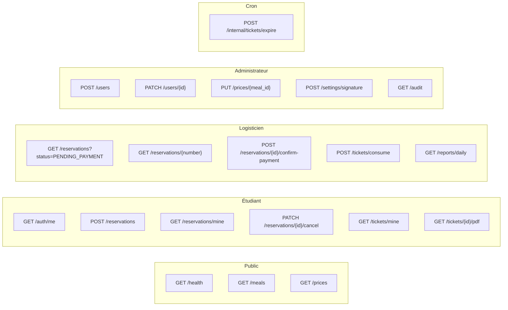

# Étape 5 — API REST

Préfixe : `/api/v1`. Authentification : `Authorization: Bearer <jwt_supabase>` sauf mention contraire.
Toutes les réponses suivent l'enveloppe `{ "success": true, "data": ..., "meta": ... }` définie à l'étape 4.9.

## 5.1 Vue d'ensemble



| Domaine | Base |
|---|---|
| Santé | `/health` |
| Authentification | `/auth/*` |
| Repas et tarifs | `/meals`, `/prices` |
| Réservations | `/reservations/*` |
| Paiements | `/reservations/{id}/confirm-payment` |
| Tickets | `/tickets/*` |
| Comptes | `/users/*` |
| Réglages | `/settings/*` |
| Rapports | `/reports/*` |
| Audit | `/audit` |
| Tâches internes | `/internal/*` |

Légende des rôles : **E** étudiant, **L** logisticien, **A** admin, **C** cron signé.

---

## 5.2 Santé et méta

### `GET /health` — public

```jsonc
{
  "success": true,
  "data": {
    "status": "ok",
    "version": "1.0.0",
    "database": "up",
    "timestamp": "2026-10-09T09:12:44Z"
  }
}
```

`503` si la base est injoignable : `{"error": {"code": "DATABASE_UNAVAILABLE"}}`

---

## 5.3 Authentification

La connexion est déléguée à Supabase Auth. Le backend ne crée pas de session, il **vérifie** le JWT.

```
POST https://<projet>.supabase.co/auth/v1/token?grant_type=password
{ "email": "...", "password": "..." }
→ { "access_token": "...", "refresh_token": "...", "expires_in": 3600 }
```

Le frontend envoie ensuite `access_token` sur chaque appel.

### `GET /auth/me` — E L A

Renvoie le profil applicatif de l'utilisateur connecté.

```jsonc
{
  "success": true,
  "data": {
    "id": "8f1c…",
    "matricule": "ETU-2024-0198",
    "full_name": "Awa Traoré",
    "room": "B12-204",
    "role": "student",
    "is_active": true,
    "created_at": "2026-09-02T08:00:00Z"
  }
}
```

Erreurs : `401 AUTH_REQUIRED`, `401 TOKEN_EXPIRED`, `403 ACCOUNT_DISABLED`.

---

## 5.4 Repas et tarifs

### `GET /meals` — E L A

Liste les repas actifs avec leur prix courant.

```jsonc
{
  "success": true,
  "data": [
    {
      "id": 1,
      "code": "BREAKFAST",
      "name": "Petit-déjeuner",
      "description": "Petit-déjeuner universitaire",
      "display_order": 1,
      "price": { "id": 12, "amount": "150.00", "currency": "XOF", "effective_from": "2026-09-01" }
    },
    { "id": 2, "code": "LUNCH", "name": "Déjeuner", "price": { "amount": "400.00", "currency": "XOF" } },
    { "id": 3, "code": "DINNER", "name": "Dîner", "price": { "amount": "350.00", "currency": "XOF" } }
  ]
}
```

`404 MEAL_NOT_FOUND` n'existe pas ici ; un repas sans prix courant renvoie `"price": null` et n'est pas réservable.

### `GET /prices/{meal_id}` — E L A

Historique complet des prix d'un repas.

```jsonc
{
  "success": true,
  "data": {
    "meal_type_id": 2,
    "prices": [
      { "id": 14, "amount": "400.00", "effective_from": "2026-09-01", "effective_to": null,     "is_current": true },
      { "id": 11, "amount": "350.00", "effective_from": "2025-09-01", "effective_to": "2026-08-31", "is_current": false }
    ]
  }
}
```

### `PUT /prices/{meal_id}` — A

Ouvre une nouvelle période de prix. Règle 2 : le prix vient toujours de la base.

```jsonc
// requête
{ "amount": "450.00", "effective_from": "2026-11-01", "reason": "Révision tarifaire Novembre" }

// réponse 200
{ "success": true, "data": { "id": 15, "amount": "450.00", "effective_from": "2026-11-01", "effective_to": null } }
```

- `422 VALIDATION_ERROR` si `amount <= 0` ou `effective_from` manquant.
- `409 PRICE_PERIOD_OVERLAP` si la période chevauche un prix existant (contrainte d'exclusion SQL).
- Écrit `price.update` dans `audit_logs`.

**Le prix courant n'est jamais modifié : on le clôture et on en ouvre un nouveau.** C'est ce qui garantit que l'historique reste intact (règle 3).

---

## 5.5 Réservations

### `POST /reservations` — E L A

L'étudiant prépare sa demande. Le backend relit les prix en base, le total est recalculé par trigger.

```jsonc
// requête
{
  "items": [
    { "meal_type_id": 2, "quantity": 10 },
    { "meal_type_id": 3, "quantity": 5 },
    { "meal_type_id": 1, "quantity": 2 }
  ],
  "note": "Pour le groupe B12"
}

// réponse 201
{
  "success": true,
  "data": {
    "id": "c31a…",
    "reservation_number": "RES-2026-000137",
    "status": "PENDING_PAYMENT",
    "items_count": 17,
    "total_amount": "6300.00",
    "currency": "XOF",
    "items": [
      { "id": "…", "meal_type_id": 2, "meal_name": "Déjeuner",    "quantity": 10, "unit_price": "400.00", "line_total": "4000.00" },
      { "id": "…", "meal_type_id": 3, "meal_name": "Dîner",       "quantity": 5,  "unit_price": "350.00", "line_total": "1750.00" },
      { "id": "…", "meal_type_id": 1, "meal_name": "Petit-déj.",  "quantity": 2,  "unit_price": "150.00", "line_total": "300.00" }
    ],
    "created_at": "2026-10-09T09:15:02Z"
  }
}
```

Erreurs :
- `422 VALIDATION_ERROR` — `items` vide, quantité hors de 1–99, deux lignes pour le même repas.
- `404 MEAL_NOT_FOUND` — repas inexistant ou sans prix courant.
- `409 RESERVATION_LIMIT_REACHED` — plus de 10 lignes différentes (paramètre `reservation.max_items_per_reservation`).

Règles couvertes : 1, 2, 3.

### `GET /reservations/mine` — E L A

```jsonc
{
  "success": true,
  "data": {
    "items": [
      {
        "reservation_number": "RES-2026-000137",
        "status": "PAID",
        "items_count": 17,
        "total_amount": "6300.00",
        "tickets_generated": 17,
        "tickets_used": 9,
        "tickets_pending": 8,
        "paid_at": "2026-10-09T09:22:10Z"
      }
    ],
    "pagination": { "page": 1, "page_size": 20, "total": 1, "pages": 1 }
  }
}
```

Paramètres : `?status=PAID&page=1&page_size=20&from=2026-09-01&to=2026-10-09`

### `GET /reservations` — L A

File d'attente d'encaissement et recherche.

```
GET /reservations?status=PENDING_PAYMENT&page=1&page_size=20
GET /reservations?number=RES-2026-000137
GET /reservations?matricule=ETU-2024-0198
GET /reservations?status=PAID&from=2026-10-01
```

```jsonc
{
  "success": true,
  "data": {
    "items": [
      {
        "id": "c31a…",
        "reservation_number": "RES-2026-000137",
        "status": "PENDING_PAYMENT",
        "student": { "id": "8f1c…", "matricule": "ETU-2024-0198", "full_name": "Awa Traoré", "room": "B12-204" },
        "items_count": 17,
        "total_amount": "6300.00",
        "currency": "XOF",
        "items": [ { "meal_name": "Déjeuner", "quantity": 10, "line_total": "4000.00" } ],
        "waiting_minutes": 6,
        "created_at": "2026-10-09T09:15:02Z"
      }
    ],
    "pagination": { "page": 1, "page_size": 20, "total": 3, "pages": 1 }
  }
}
```

### `GET /reservations/{id}` — E (les siennes) L A

Même forme, plus `tickets` si payée.

### `PATCH /reservations/{id}/cancel` — E (les siennes, `PENDING_PAYMENT`) L A

```jsonc
// requête
{ "reason": "Changement de programme" }

// réponse 200
{ "success": true, "data": { "reservation_number": "RES-2026-000137", "status": "CANCELLED", "cancelled_at": "…" } }
```

- `409 RESERVATION_PAID_FINAL` — annulation après paiement refusée (hors périmètre, gestion manuelle).
- `409 RESERVATION_LOCKED` — déjà annulée (idempotent : renvoie l'état actuel avec `"already_cancelled": true`).

### `POST /reservations/{id}/confirm-payment` — L A (jamais E)

L'opération clé. Un clic, paiement en espèces encaissé, tickets générés.

```jsonc
// requête
{
  "cash_received": "6500.00",
  "change_given": "200.00",
  "note": "Espèces reçues"
}

// réponse 200
{
  "success": true,
  "data": {
    "reservation_id": "c31a…",
    "reservation_number": "RES-2026-000137",
    "status": "PAID",
    "already_confirmed": false,
    "total_amount": "6300.00",
    "paid_at": "2026-10-09T09:22:10Z",
    "ticket_count": 17,
    "tickets": [
      { "ticket_number": "TKT-2026-000412", "meal_type_id": 2, "meal_name": "Déjeuner",   "valid_until": "2026-11-08" },
      { "ticket_number": "TKT-2026-000413", "meal_type_id": 2, "meal_name": "Déjeuner",   "valid_until": "2026-11-08" }
    ],
    "pdf": {
      "sheet_url": "https://…signed…",
      "per_ticket_urls": ["https://…signed…", "https://…signed…"],
      "expires_in_seconds": 300
    }
  }
}
```

Second clic sur la même réservation :

```jsonc
{ "success": true, "data": { "status": "PAID", "already_confirmed": true, "ticket_count": 17, "paid_at": "2026-10-09T09:22:10Z" } }
```

**Aucun ticket n'est créé deux fois.** C'est la règle 9, appliquée par `select … for update` dans `fn_confirm_payment`.

Erreurs :
- `403 ROLE_FORBIDDEN` — un étudiant qui tente l'appel.
- `404 RESERVATION_NOT_FOUND`.
- `409 RESERVATION_CANCELLED` — réservation annulée, non encaissable.
- `409 RESERVATION_LOCKED` — verrou concurrent momentané, réessayer.
- `422 VALIDATION_ERROR` — `cash_received < total_amount` (avertissement côté métier, pas un blocage : le paiement partiel est refusé).

`cash_received` et `change_given` sont informatifs : **aucun paiement en ligne n'est intégré**, conformément à l'étape 1.2. Ils alimentent la caisse du jour.

---

## 5.6 Tickets

### `GET /tickets/mine` — E

```jsonc
{
  "success": true,
  "data": {
    "items": [
      {
        "ticket_number": "TKT-2026-000412",
        "status": "GENERATED",
        "meal_name": "Déjeuner",
        "reservation_number": "RES-2026-000137",
        "valid_until": "2026-11-08",
        "used_at": null,
        "pdf_url": "https://…signed…",
        "created_at": "2026-10-09T09:22:10Z"
      }
    ],
    "pagination": { "page": 1, "page_size": 20, "total": 17, "pages": 1 }
  }
}
```

Paramètres : `?status=GENERATED&reservation_id=…&page=1&page_size=20`

### `GET /tickets/{id}` — E (les siens) L A

Détail complet, y compris `qr_payload` (l'étudiant en a besoin pour afficher son QR).

```jsonc
{
  "success": true,
  "data": {
    "ticket_number": "TKT-2026-000412",
    "status": "GENERATED",
    "qr_payload": "TKT-2026-000412.1.9f2c8ab41d03e7a5",
    "meal": { "id": 2, "code": "LUNCH", "name": "Déjeuner" },
    "reservation_number": "RES-2026-000137",
    "student": { "matricule": "ETU-2024-0198", "full_name": "Awa Traoré" },
    "valid_until": "2026-11-08",
    "used_at": null,
    "used_by": null,
    "pdf_path": "pdf/8f1c…/TKT-2026-000412.pdf",
    "pdf_url": "https://…signed…"
  }
}
```

`404 TICKET_NOT_FOUND` — numéro inconnu.

### `GET /tickets/{id}/pdf` — E (les siens) L A

Renvoie le PDF (`application/pdf`) avec `Content-Disposition: inline`.
Réponse : `302` vers une URL signée Supabase valable 5 minutes, ou le flux binaire selon l'option retenue en 4.13.

Headers : `Cache-Control: no-store`, `X-Content-Type-Options: nosniff`.

### `POST /tickets/consume` — L A (jamais E)

Scan au restaurant. Le QR est vérifié cryptographiquement avant tout accès à la base.

```jsonc
// requête — depuis le scanner
{ "qr_payload": "TKT-2026-000412.1.9f2c8ab41d03e7a5" }

// ou saisie manuelle du numéro
{ "ticket_number": "TKT-2026-000412" }

// réponse 200
{
  "success": true,
  "data": {
    "ticket_number": "TKT-2026-000412",
    "status": "USED",
    "used_at": "2026-10-09T12:14:03Z",
    "meal_name": "Déjeuner",
    "student": { "matricule": "ETU-2024-0198", "full_name": "Awa Traoré", "room": "B12-204" },
    "consumed_by": { "id": "3b7e…", "full_name": "Ibrahim Koné" }
  }
}
```

Erreurs :

```jsonc
// 401 — QR falsifié ou clé inconnue
{ "success": false, "error": { "code": "QR_INVALID", "message": "Signature du ticket invalide." } }

// 409 — double scan
{
  "success": false,
  "error": {
    "code": "TICKET_ALREADY_USED",
    "message": "TKT-2026-000412 a déjà été consommé le 09/10/2026 à 12:14",
    "details": { "ticket_number": "TKT-2026-000412", "used_at": "2026-10-09T12:14:03Z", "used_by": "Ibrahim Koné" }
  }
}

// 410 — ticket périmé
{ "success": false, "error": { "code": "TICKET_EXPIRED", "message": "TKT-2026-000410 a expiré le 09/11/2026." } }

// 404
{ "success": false, "error": { "code": "TICKET_NOT_FOUND", "message": "TKT-2026-999999 inconnu." } }
```

Règles couvertes : 6, 9, 10. Limitation : 10 requêtes/minute/adresse.

### `GET /tickets` — L A

Recherche et supervision.

```
GET /tickets?status=GENERATED&meal_type_id=2&page=1
GET /tickets?ticket_number=TKT-2026-000412
GET /tickets?student_matricule=ETU-2024-0198
```

### `POST /tickets/{id}/void` — A

Annulation d'un ticket frauduleux, par l'administrateur uniquement.

```jsonc
{ "reason": "Ticket dupliqué signalé par l'étudiant" }
→ { "success": true, "data": { "ticket_number": "TKT-2026-000412", "status": "EXPIRED", "expired_at": "…" } }
```

Refusé si le ticket est déjà `USED` : `409 TICKET_USED_FINAL`. Écrit `ticket.void` dans l'audit.

---

## 5.7 Comptes (admin)

### `POST /users` — A

Création sans inscription libre (hypothèse étape 1.6).

```jsonc
// requête
{
  "email": "awa.traore@univ.edu",
  "password": "…",
  "full_name": "Awa Traoré",
  "matricule": "ETU-2024-0198",
  "room": "B12-204",
  "phone": "+226 …",
  "role": "student"
}
→ 201 { "success": true, "data": { "id": "8f1c…", "matricule": "ETU-2024-0198", "role": "student", "is_active": true } }
```

- `422 VALIDATION_ERROR` — étudiant sans matricule ou sans chambre.
- `409 MATRICULE_ALREADY_EXISTS`.
- `409 EMAIL_ALREADY_EXISTS`.

### `POST /users/import` — A

Import en lot (CSV) pour la rentrée.

```jsonc
{ "rows": [ { "email": "…", "full_name": "…", "matricule": "…", "room": "…" } ], "role": "student" }
→ { "success": true, "data": { "created": 148, "skipped": 2, "errors": [ { "row": 57, "reason": "MATRICULE_ALREADY_EXISTS" } ] } }
```

### `GET /users` — A

```
GET /users?role=student&search=traore&is_active=true&page=1
```

### `PATCH /users/{id}` — A

Modification du rôle, de l'activation, des informations.

```jsonc
{ "role": "logistician", "is_active": true, "room": "B12-210" }
→ { "success": true, "data": { "id": "8f1c…", "role": "logistician", "is_active": true } }
```

- `403 ROLE_CHANGE_FORBIDDEN` si l'appelant n'est pas admin (défendu aussi par le trigger SQL).
- Un compte désactivé ne peut plus se connecter : `403 ACCOUNT_DISABLED`.
- L'admin ne peut pas se retirer lui-même le rôle admin : `422 CANNOT_DEMOTE_SELF`.

### `DELETE /users/{id}` — A

Désactivation logique (`is_active = false`), jamais de suppression : l'historique des ventes doit rester exploitable.

---

## 5.8 Réglages

### `GET /settings` — E L A

Paramètres non sensibles (validité des tickets, identité du restaurant, template PDF).

```jsonc
{ "success": true, "data": {
  "resto.identity": { "name": "Restauration universitaire", "city": "…", "phone": "…" },
  "tickets.validity_days": 30,
  "tickets.pdf_template": { "page": "A5", "orientation": "portrait", "per_page": 4 },
  "qr.secret_version": 1
} }
```

Les chemins de la signature et du cachet ne sont **pas** renvoyés aux étudiants.

### `PUT /settings/{key}` — A

```jsonc
{ "value": { "name": "Restauration universitaire — Campus Est", "city": "Ouagadougou" } }
```

### `POST /settings/signature` — A

Upload de l'image de signature (`multipart/form-data`, PNG/JPG/WebP, ≤ 2 Mo).

```
Content-Type: multipart/form-data
file=<signature.png>
→ { "success": true, "data": { "path": "images/signature.png", "uploaded_at": "…" } }
```

`422 IMAGE_TOO_LARGE`, `422 UNSUPPORTED_MEDIA_TYPE`. Le fichier remplace le précédent et alimente les PDF suivants.

### `POST /settings/cachet` — A

Identique, pour le cachet.

---

## 5.9 Rapports

### `GET /reports/dashboard` — L A

```jsonc
{
  "success": true,
  "data": {
    "today": {
      "revenue": "45000.00",
      "reservations_paid": 12,
      "meals_sold": 84,
      "tickets_used": 61,
      "tickets_pending": 23,
      "tickets_expired": 4,
      "pending_payments": 3
    },
    "by_meal": [
      { "meal": "Petit-déjeuner", "ordered": 20, "used": 14, "revenue": "3000.00" },
      { "meal": "Déjeuner",       "ordered": 45, "used": 32, "revenue": "18000.00" },
      { "meal": "Dîner",          "ordered": 19, "used": 15, "revenue": "6650.00" }
    ],
    "queue": [
      { "reservation_number": "RES-2026-000137", "student_name": "Awa Traoré", "total_amount": "6300.00", "waiting_minutes": 6 }
    ]
  }
}
```

### `GET /reports/daily` — L A

```
GET /reports/daily?from=2026-10-01&to=2026-10-09
→ { "data": { "days": [ { "sale_date": "2026-10-08", "reservations_paid": 9, "revenue": "38250.00", "meals_sold": 63, "tickets_used": 51 } ] } }
```

### `GET /reports/monthly` — L A

Lit `mv_monthly_report` (vue matérialisée).

### `GET /reports/export` — L A

```
GET /reports/export?type=daily&from=2026-10-01&to=2026-10-09&format=csv
→ text/csv, Content-Disposition: attachment
```

Formats : `csv`, `pdf`. Une ligne par journée, par repas si `?type=by_meal`.

---

## 5.10 Audit

### `GET /audit` — A

```jsonc
{
  "success": true,
  "data": {
    "items": [
      {
        "id": 4821,
        "action": "payment.confirm",
        "actor": { "id": "3b7e…", "full_name": "Ibrahim Koné", "role": "logistician" },
        "entity_type": "reservation",
        "entity_id": "RES-2026-000137",
        "outcome": "SUCCESS",
        "metadata": { "total_amount": 6300, "ticket_count": 17, "student_id": "8f1c…" },
        "ip": "41.xx.xx.xx",
        "created_at": "2026-10-09T09:22:10Z"
      }
    ],
    "pagination": { "page": 1, "page_size": 50, "total": 4821, "pages": 97 }
  }
}
```

Filtres : `?action=payment.confirm&actor_id=…&entity_id=…&outcome=FAILURE&from=…&to=…`

**Aucune route d'écriture, de modification ni de suppression n'existe sur l'audit.** Le journal est en lecture seule par conception (règle 10).

Actions journalisées : `reservation.create`, `reservation.cancel`, `payment.confirm`, `ticket.consume`, `ticket.expire`, `ticket.void`, `price.update`, `user.create`, `user.update`, `settings.update`, `auth.login_failed`.

---

## 5.11 Tâches internes

Protégées par `X-Cron-Secret`, non exposées publiquement.

### `POST /internal/tickets/expire` — C

```jsonc
{ "success": true, "data": { "expired_count": 7 } }
```

Appelle `fn_expire_tickets()`. Planifié chaque jour à 00:05.

### `POST /internal/sequences/reset` — C

Remet les compteurs de numérotation à zéro, le 1er janvier uniquement.

---

## 5.12 Récapitulatif des permissions

| Route | E | L | A | C |
|---|:--:|:--:|:--:|:--:|
| `GET /health`, `GET /meals`, `GET /prices` | ✅ | ✅ | ✅ | |
| `GET /auth/me` | ✅ | ✅ | ✅ | |
| `POST /reservations` | ✅ | ✅ | ✅ | |
| `GET /reservations/mine` | ✅ | ✅ | ✅ | |
| `GET /reservations` | | ✅ | ✅ | |
| `GET /reservations/{id}` | ✅ sien | ✅ | ✅ | |
| `PATCH /reservations/{id}/cancel` | ✅ sien | ✅ | ✅ | |
| `POST /reservations/{id}/confirm-payment` | ❌ | ✅ | ✅ | |
| `GET /tickets/mine` | ✅ | ✅ | ✅ | |
| `GET /tickets/{id}` | ✅ sien | ✅ | ✅ | |
| `GET /tickets/{id}/pdf` | ✅ sien | ✅ | ✅ | |
| `GET /tickets` | | ✅ | ✅ | |
| `POST /tickets/consume` | ❌ | ✅ | ✅ | |
| `POST /tickets/{id}/void` | | | ✅ | |
| `POST /users`, `GET /users`, `PATCH /users/{id}`, `DELETE /users/{id}` | | | ✅ | |
| `PUT /prices/{meal_id}` | | | ✅ | |
| `POST /settings/signature`, `/cachet`, `PUT /settings/{key}` | | | ✅ | |
| `GET /reports/*` | | ✅ | ✅ | |
| `GET /audit` | | | ✅ | |
| `POST /internal/*` | | | | ✅ |

## 5.13 Conventions transverses

1. **Pagination** : `?page=1&page_size=20`, `page_size` ≤ 100. Réponse toujours `{ items, pagination }`.
2. **Dates** : ISO 8601 UTC (`2026-10-09T09:22:10Z`) en entrée et sortie.
3. **Montants** : chaînes décimales à deux décimales (`"6300.00"`), jamais de flottant.
4. **Identifiants** : UUID pour les entités, texte lisible pour les numéros (`RES-…`, `TKT-…`).
5. **Idempotence** : les opérations d'écriture répétées renvoient l'état existant plutôt qu'une erreur, avec un drapeau `already_*`.
6. **Cache** : `Cache-Control: no-store` partout, sans exception.
7. **Versioning** : préfixe `/api/v1`. Une rupture de compatibilité ouvre `/api/v2`, l'ancienne étant maintenue 90 jours.
8. **Traçage** : chaque réponse porte `meta.request_id`, repris dans les logs et l'audit.

## 5.14 Points à valider avant l'étape 6

1. `POST /tickets/consume` doit-il accepter aussi un scan en lot (plusieurs QR d'affilée pour un groupe) ?
2. Confirmez-vous `cash_received` / `change_given` comme simples champs informatifs, sans table `payments` ?
3. L'export des rapports doit-il inclure les noms des étudiants, ou seulement des agrégats anonymisés ?
4. Faut-il une route de réimpression groupée d'une réservation entière (`GET /reservations/{id}/tickets/pdf`), ou les PDF individuels suffisent-ils ?
