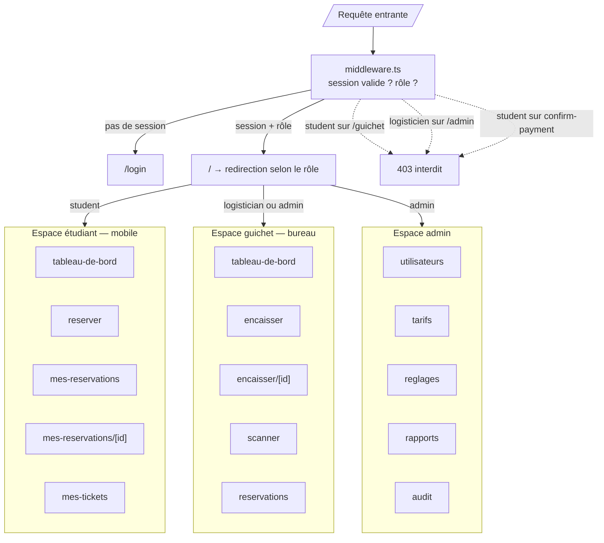

# Étape 6 — Architecture frontend (Next.js)

Next.js 14, App Router, TypeScript strict, Tailwind CSS + shadcn/ui. Déployé sur Vercel.

## 6.1 Principes

1. **Le frontend ne décide de rien.** Il ne calcule aucun montant, ne connaît aucun prix en dur, ne déduit aucun statut. Tout vient de l'API (étape 5).
2. **Aucun secret dans le navigateur.** Seules `NEXT_PUBLIC_SUPABASE_URL` et `NEXT_PUBLIC_SUPABASE_ANON_KEY` sont exposées. Le reste passe par le backend.
3. **Deux expériences, une base de code.** L'étudiant navigue sur mobile, le logisticien sur un poste fixe avec clavier et scanner.
4. **Le middleware est la seule porte.** Aucun composant ne vérifie un rôle : il ne fait que lire ce que le serveur a déjà décidé.

## 6.2 Dépendances

```json
{
  "dependencies": {
    "next": "14.2.*",
    "react": "18.3.*",
    "react-dom": "18.3.*",
    "typescript": "5.6.*",
    "@supabase/supabase-js": "2.46.*",
    "@supabase/ssr": "0.5.*",
    "tailwindcss": "3.4.*",
    "@tanstack/react-query": "5.59.*",
    "zod": "3.23.*",
    "react-hook-form": "7.53.*",
    "@hookform/resolvers": "3.9.*",
    "html5-qrcode": "2.3.*",
    "qrcode.react": "4.1.*",
    "lucide-react": "0.454.*",
    "date-fns": "4.1.*",
    "sonner": "1.7.*",
    "clsx": "2.1.*",
    "tailwind-merge": "2.5.*"
  },
  "devDependencies": {
    "eslint": "8.57.*",
    "eslint-config-next": "14.2.*",
    "prettier": "3.3.*",
    "vitest": "2.1.*",
    "@testing-library/react": "16.0.*",
    "playwright": "1.48.*"
  }
}
```

## 6.3 Structure

```
frontend/
├── src/
│   ├── app/
│   │   ├── layout.tsx                    # racine : polices, thème, providers
│   │   ├── page.tsx                      # redirection selon le rôle
│   │   ├── globals.css
│   │   │
│   │   ├── (auth)/                       # pages publiques, layout centré
│   │   │   ├── layout.tsx
│   │   │   ├── login/page.tsx
│   │   │   └── mot-de-passe-oublie/page.tsx
│   │   │
│   │   ├── (etudiant)/                   # shell mobile, onglets bas
│   │   │   ├── layout.tsx                # garde rôle : student
│   │   │   ├── tableau-de-bord/page.tsx
│   │   │   ├── reserver/page.tsx         # création de réservation
│   │   │   ├── mes-reservations/page.tsx
│   │   │   ├── mes-reservations/[id]/page.tsx
│   │   │   └── mes-tickets/page.tsx
│   │   │
│   │   ├── (guichet)/                    # shell bureau, sidebar
│   │   │   ├── layout.tsx                # garde rôle : staff
│   │   │   ├── tableau-de-bord/page.tsx  # chiffres du jour + file d'attente
│   │   │   ├── encaisser/page.tsx        # recherche → vérification → encaissement
│   │   │   ├── encaisser/[id]/page.tsx   # détail + bouton confirmer
│   │   │   ├── scanner/page.tsx          # caméra + QR
│   │   │   └── reservations/page.tsx     # historique
│   │   │
│   │   ├── (admin)/                      # shell back-office
│   │   │   ├── layout.tsx                # garde rôle : admin
│   │   │   ├── utilisateurs/page.tsx
│   │   │   ├── utilisateurs/[id]/page.tsx
│   │   │   ├── tarifs/page.tsx
│   │   │   ├── reglages/page.tsx         # signature, cachet, validité
│   │   │   ├── rapports/page.tsx
│   │   │   └── audit/page.tsx
│   │   │
│   │   ├── api/                          # route handlers (BFF)
│   │   │   ├── auth/callback/route.ts    # échange code Supabase
│   │   │   └── revalidate/route.ts
│   │   │
│   │   └── erreur/
│   │       ├── not-found.tsx
│   │       ├── error.tsx
│   │       └── forbidden.tsx
│   │
│   ├── components/
│   │   ├── ui/                           # primitives shadcn/ui
│   │   │   ├── button.tsx  card.tsx  input.tsx  select.tsx
│   │   │   ├── dialog.tsx  table.tsx  badge.tsx  skeleton.tsx
│   │   │   ├── tabs.tsx    toast.tsx  alert.tsx  dropdown.tsx
│   │   │   └── empty-state.tsx
│   │   │
│   │   ├── layout/
│   │   │   ├── student-shell.tsx         # en-tête + onglets bas
│   │   │   ├── desk-shell.tsx            # sidebar + barre supérieure
│   │   │   ├── admin-shell.tsx
│   │   │   └── role-badge.tsx
│   │   │
│   │   ├── reservations/
│   │   │   ├── reservation-form.tsx      # sélection repas + quantités
│   │   │   ├── meal-picker.tsx
│   │   │   ├── quantity-stepper.tsx
│   │   │   ├── reservation-summary.tsx   # total lu depuis l'API, jamais calculé
│   │   │   ├── reservation-list.tsx
│   │   │   ├── reservation-detail.tsx
│   │   │   └── cancel-reservation-dialog.tsx
│   │   │
│   │   ├── payment/
│   │   │   ├── confirm-payment-card.tsx  # bouton unique, état « en cours »
│   │   │   ├── cash-fields.tsx           # reçu / monnaie rendue
│   │   │   └── payment-result.tsx        # feuille de tickets à imprimer
│   │   │
│   │   ├── tickets/
│   │   │   ├── ticket-card.tsx           # statut + actions
│   │   │   ├── ticket-list.tsx
│   │   │   ├── ticket-qr.tsx             # rendu QR depuis qr_payload
│   │   │   ├── ticket-pdf-button.tsx
│   │   │   └── ticket-status-badge.tsx
│   │   │
│   │   ├── scanner/
│   │   │   ├── qr-scanner.tsx            # caméra
│   │   │   ├── manual-entry.tsx          # saisie du numéro
│   │   │   └── consume-result.tsx        # feedback visuel et sonore
│   │   │
│   │   ├── admin/
│   │   │   ├── user-table.tsx
│   │   │   ├── user-form.tsx
│   │   │   ├── user-import.tsx
│   │   │   ├── price-editor.tsx
│   │   │   ├── signature-uploader.tsx
│   │   │   └── audit-table.tsx
│   │   │
│   │   └── reports/
│   │       ├── kpi-cards.tsx
│   │       ├── daily-sales-table.tsx
│   │       ├── meal-breakdown.tsx
│   │       └── export-button.tsx
│   │
│   ├── lib/
│   │   ├── api-client.ts                 # fetch typé, enveloppe, erreurs
│   │   ├── supabase/
│   │   │   ├── client.ts                 # client navigateur
│   │   │   ├── server.ts                 # client serveur (cookies)
│   │   │   └── middleware.ts             # rafraîchissement de session
│   │   ├── auth/
│   │   │   ├── session.ts                # getSession serveur
│   │   │   └── roles.ts                  # types et gardes de rôle
│   │   ├── validation/
│   │   │   ├── reservation.ts            # schémas Zod, miroir de l'API
│   │   │   ├── user.ts
│   │   │   └── price.ts
│   │   ├── format/
│   │   │   ├── money.ts                  # "6 300 FCFA"
│   │   │   ├── date.ts                   # formats localisés
│   │   │   └── status.ts                 # libellés de statut
│   │   ├── hooks/
│   │   │   ├── use-reservations.ts
│   │   │   ├── use-payment.ts
│   │   │   ├── use-tickets.ts
│   │   │   ├── use-scanner.ts
│   │   │   └── use-debounce.ts
│   │   └── utils.ts                      # cn(), constantes
│   │
│   ├── providers/
│   │   ├── query-provider.tsx            # TanStack Query
│   │   ├── theme-provider.tsx
│   │   └── toast-provider.tsx
│   │
│   └── middleware.ts                     # garde de session + de rôle
│
├── public/
│   ├── logo.svg
│   ├── icons/
│   └── sounds/
│       ├── success.mp3                   # feedback du scan
│       └── error.mp3
│
├── tests/
│   ├── e2e/
│   │   ├── reservation.spec.ts           # parcours étudiant
│   │   ├── encaissement.spec.ts          # parcours logisticien
│   │   ├── scan.spec.ts                  # scan simple et double scan
│   │   └── admin.spec.ts
│   └── unit/
│       ├── money.test.ts
│       └── validation.test.ts
│
├── next.config.mjs
├── tailwind.config.ts
├── tsconfig.json                         # "strict": true
└── .env.local                            # jamais commité
```

## 6.4 Routes et rôles



### Table des routes

| Route | Rôle requis | Rendu | Données |
|---|---|---|---|
| `/login` | public | Client | — |
| `/mot-de-passe-oublie` | public | Client | — |
| `/` | connecté | Serveur | profil |
| `/(etudiant)/tableau-de-bord` | student | Serveur | stats du jour |
| `/(etudiant)/reserver` | student | Client | repas + prix |
| `/(etudiant)/mes-reservations` | student | Serveur | liste paginée |
| `/(etudiant)/mes-reservations/[id]` | student, propriétaire | Serveur | détail + tickets |
| `/(etudiant)/mes-tickets` | student | Serveur | tickets filtrables |
| `/(guichet)/tableau-de-bord` | staff | Serveur | KPI + file |
| `/(guichet)/encaisser` | staff | Client | file d'attente temps réel |
| `/(guichet)/encaisser/[id]` | staff | Client | détail + encaissement |
| `/(guichet)/scanner` | staff | Client | caméra |
| `/(guichet)/reservations` | staff | Serveur | historique |
| `/(admin)/utilisateurs` | admin | Serveur | comptes |
| `/(admin)/utilisateurs/[id]` | admin | Client | fiche compte |
| `/(admin)/tarifs` | admin | Client | historique des prix |
| `/(admin)/reglages` | admin | Client | signature, cachet, validité |
| `/(admin)/rapports` | admin | Serveur | agrégats |
| `/(admin)/audit` | admin | Serveur | journal paginé |

Le logisticien **ne voit jamais** l'espace admin ; l'admin voit les deux.

## 6.5 Layouts

### Layout racine

```tsx
// src/app/layout.tsx
import type { Metadata } from "next";
import { Inter } from "next/font/google";
import { QueryProvider } from "@/providers/query-provider";
import { ToastProvider } from "@/providers/toast-provider";

export const metadata: Metadata = {
  title: { default: "Restauration universitaire", template: "%s · Resto Smart" },
  description: "Réservation, paiement et consommation des tickets de restauration",
  robots: { index: false, follow: false },        // application privée
};

export default function RootLayout({ children }: { children: React.ReactNode }) {
  return (
    <html lang="fr" suppressHydrationWarning>
      <body className={inter.className}>
        <QueryProvider>
          <ToastProvider>{children}</ToastProvider>
        </QueryProvider>
      </body>
    </html>
  );
}
```

### Layout étudiant (mobile, onglets)

```tsx
// src/app/(etudiant)/layout.tsx
import { redirect } from "next/navigation";
import { createClient } from "@/lib/supabase/server";
import { StudentShell } from "@/components/layout/student-shell";

export default async function EtudiantLayout({ children }: { children: React.ReactNode }) {
  const supabase = createClient();
  const { data: { user } } = await supabase.auth.getUser();
  if (!user) redirect("/login");

  const { data: profile } = await supabase
    .from("profiles").select("role, is_active, full_name, matricule").eq("id", user.id).single();

  if (!profile || !profile.is_active) redirect("/login?error=ACCOUNT_DISABLED");
  if (profile.role !== "student") redirect("/");

  return (
    <StudentShell profile={profile}>
      <main className="pb-20">{children}</main>
    </StudentShell>
  );
}
```

### Layout guichet (bureau, sidebar)

```tsx
// src/app/(guichet)/layout.tsx
import { redirect } from "next/navigation";
import { createClient } from "@/lib/supabase/server";
import { DeskShell } from "@/components/layout/desk-shell";

export default async function GuichetLayout({ children }: { children: React.ReactNode }) {
  const supabase = createClient();
  const { data: { user } } = await supabase.auth.getUser();
  if (!user) redirect("/login");

  const { data: profile } = await supabase.from("profiles").select("role, is_active, full_name").eq("id", user.id).single();
  if (!profile?.is_active) redirect("/login?error=ACCOUNT_DISABLED");
  if (!["logistician", "admin"].includes(profile.role)) redirect("/interdit");

  return (
    <DeskShell profile={profile}>
      <main className="lg:pl-64">{children}</main>
    </DeskShell>
  );
}
```

## 6.6 Middleware

Le middleware rafraîchit la session Supabase et applique une pré-garde de route. **Il ne remplace pas les vérifications serveur** : chaque layout revérifie le rôle en lisant `profiles`, et l'API revérifie une troisième fois.

```ts
// src/middleware.ts
import { createServerClient, type CookieOptions } from "@supabase/ssr";
import { NextResponse, type NextRequest } from "next/server";

const PUBLIC = ["/login", "/mot-de-passe-oublie", "/auth/callback"];
const PREFIX_ROLE: Record<string, string[]> = {
  "/guichet": ["logistician", "admin"],
  "/admin": ["admin"],
  "/etudiant": ["student"],
};

export async function middleware(req: NextRequest) {
  let res = NextResponse.next({ request: { headers: req.headers } });

  const supabase = createServerClient(
    process.env.NEXT_PUBLIC_SUPABASE_URL!,
    process.env.NEXT_PUBLIC_SUPABASE_ANON_KEY!,
    {
      cookies: {
        get: (n) => req.cookies.get(n)?.value,
        set: (n, v, o: CookieOptions) => { res.cookies.set({ name: n, value: v, ...o }); },
        remove: (n, o) => { res.cookies.set({ name: n, value: "", ...o }); },
      },
    },
  );

  const { data: { user } } = await supabase.auth.getUser();
  const { pathname } = req.nextUrl;

  if (!user && !PUBLIC.some((p) => pathname.startsWith(p))) {
    return NextResponse.redirect(new URL("/login?next=" + pathname, req.url));
  }
  if (user && PUBLIC.includes(pathname)) {
    return NextResponse.redirect(new URL("/", req.url));
  }

  const prefix = Object.keys(PREFIX_ROLE).find((p) => pathname.startsWith(p));
  if (prefix && user) {
    const { data: profile } = await supabase
      .from("profiles").select("role, is_active").eq("id", user.id).single();

    if (!profile?.is_active) return NextResponse.redirect(new URL("/login?error=ACCOUNT_DISABLED", req.url));
    if (!PREFIX_ROLE[prefix].includes(profile.role)) {
      return NextResponse.redirect(new URL("/interdit", req.url));
    }
  }
  return res;
}

export const config = {
  matcher: ["/((?!_next/static|_next/image|favicon.ico|.*\\.(?:svg|png|jpg|webp|mp3)$).*)"],
};
```

## 6.7 Client API

Aucun appel `fetch` nu dans les composants. Tout passe par ce client, qui applique l'enveloppe de l'étape 5.13.

```ts
// src/lib/api-client.ts
export class ApiError extends Error {
  constructor(
    public code: string,
    message: string,
    public status: number,
    public details?: Record<string, unknown>,
    public requestId?: string,
  ) { super(message); }
}

type Envelope<T> = { success: true; data: T } | {
  success: false; error: { code: string; message: string; details?: unknown; request_id?: string };
};

export async function api<T>(path: string, init?: RequestInit): Promise<T> {
  const res = await fetch(`${process.env.NEXT_PUBLIC_API_URL}${path}`, {
    ...init,
    credentials: "include",
    cache: "no-store",                                  // règle 6 de l'étape 5.13
    headers: {
      "Content-Type": "application/json",
      ...(init?.headers ?? {}),
    },
  });

  const body: Envelope<T> = await res.json();

  if (!body.success) {
    throw new ApiError(body.error.code, body.error.message, res.status,
                       body.error.details as Record<string, unknown>, body.error.request_id);
  }
  return body.data;
}
```

Le jeton Supabase est transmis par le cookie de session, lu par le BFF ; il n'est donc jamais manipulé en JavaScript.

## 6.8 États de chargement et d'erreur

Chaque écran a **quatre** états explicites, jamais d'écran blanc.

| État | Étudiant | Guichet |
|---|---|---|
| Chargement | `Skeleton` en forme de carte de ticket | `Skeleton` de tableau + file d'attente |
| Vide | `EmptyState` « Aucun ticket pour l'instant » + bouton Réserver | `EmptyState` « File vide » |
| Erreur réseau | `Alert` + bouton Réessayer | `Alert` + bouton Réessayer |
| Erreur métier | Message exact du backend (ex. `TICKET_ALREADY_USED`) | Message exact + actions suggérées |

```tsx
// src/components/tickets/ticket-list.tsx
export function TicketList({ status }: { status?: TicketStatus }) {
  const { data, isLoading, isError, error, refetch } = useTickets({ status });

  if (isLoading) return <TicketListSkeleton count={4} />;
  if (isError) return <ErrorState error={error as ApiError} onRetry={refetch} />;
  if (!data?.items.length) return <EmptyTickets />;

  return (
    <ul className="grid gap-3 sm:grid-cols-2">
      {data.items.map((t) => <TicketCard key={t.id} ticket={t} />)}
    </ul>
  );
}
```

## 6.9 Gestion des états serveur

TanStack Query, avec des clés stables et une invalidation ciblée.

```ts
// src/lib/hooks/use-tickets.ts
export const ticketKeys = {
  all: ["tickets"] as const,
  mine: (f: TicketFilters) => [...ticketKeys.all, "mine", f] as const,
  detail: (id: string) => [...ticketKeys.all, id] as const,
};

export function useTickets(filters: TicketFilters) {
  return useQuery({
    queryKey: ticketKeys.mine(filters),
    queryFn: () => api<TicketPage>(`/tickets/mine?${new URLSearchParams(filters as never)}`),
    staleTime: 15_000,
  });
}

// Après un encaissement : invalidation croisée
export function useConfirmPayment() {
  const qc = useQueryClient();
  return useMutation({
    mutationFn: (v: ConfirmPaymentIn) => api<ConfirmPaymentOut>(`/reservations/${v.id}/confirm-payment`, {
      method: "POST", body: JSON.stringify(v),
    }),
    onSuccess: () => {
      qc.invalidateQueries({ queryKey: ["reservations"] });
      qc.invalidateQueries({ queryKey: ["tickets"] });
      qc.invalidateQueries({ queryKey: ["reports"] });
    },
  });
}
```

| Donnée | `staleTime` | Pourquoi |
|---|---|---|
| Repas et prix | 5 min | Changent rarement |
| Liste des réservations | 15 s | Le guichet voit arriver les nouvelles |
| Détail réservation | 0 | Avant encaissement, toujours frais |
| Mes tickets | 15 s | Changent à la consommation |
| Rapports | 60 s | Agrégats tolérants |
| Audit | 0 | Consultation administrative |

## 6.10 Formulaires et validation

Zod miroir des schémas Pydantic du backend. La validation client est un confort ; **la vérité reste côté serveur**.

```ts
// src/lib/validation/reservation.ts
import { z } from "zod";

export const reservationItemSchema = z.object({
  meal_type_id: z.number().int().positive(),
  quantity: z.number().int().min(1, "Au moins un repas").max(99, "99 maximum par repas"),
});

export const reservationSchema = z.object({
  items: z.array(reservationItemSchema)
    .min(1, "Ajoutez au moins un repas")
    .max(10, "10 types de repas maximum par réservation")
    .refine(
      (items) => new Set(items.map((i) => i.meal_type_id)).size === items.length,
      { message: "Un même repas ne peut apparaître qu'une fois", path: ["items"] },
    ),
  note: z.string().max(500).optional(),
});

export type ReservationFormValues = z.infer<typeof reservationSchema>;
```

```tsx
// src/components/reservations/reservation-form.tsx
const form = useForm<ReservationFormValues>({
  resolver: zodResolver(reservationSchema),
  defaultValues: { items: [{ meal_type_id: 2, quantity: 1 }] },
});

// Le total affiché est celui renvoyé par l'API après création,
// ou recalculé côté présentation à partir des prix PUBLIC de /meals.
// Aucun prix n'est codé en dur dans le frontend.
```

## 6.11 Scanner (guichet)

```tsx
// src/components/scanner/qr-scanner.tsx
"use client";
import { Html5Qrcode } from "html5-qrcode";

export function QrScanner({ onConsumed }: { onConsumed: (r: ConsumeResult) => void }) {
  const [mode, setMode] = useState<"camera" | "manual">("camera");
  const scannerRef = useRef<Html5Qrcode | null>(null);

  useEffect(() => {
    if (mode !== "camera") return;
    const scanner = new Html5Qrcode("reader");
    scannerRef.current = scanner;
    scanner.start(
      { facingMode: "environment" },
      { fps: 8, qrbox: { width: 260, height: 260 } },
      async (decoded) => {
        scanner.pause(true);                        // évite le double déclenchement
        await consume.mutateAsync({ qr_payload: decoded });
        scanner.resume();
      },
      undefined,
    ).catch(() => setMode("manual"));               // pas de caméra → saisie manuelle
    return () => { scanner.stop().catch(() => {}); };
  }, [mode]);

  return (
    <div className="space-y-4">
      {mode === "camera" ? <div id="reader" className="overflow-hidden rounded-xl" /> : <ManualEntry />}
      <ConsumeResult consume={consume} />
    </div>
  );
}
```

Le retour est **immédiat et sans ambiguïté** : bandeau vert avec le nom de l'étudiant et le repas, ou bandeau rouge avec le code exact (`TICKET_ALREADY_USED`, `TICKET_EXPIRED`, `QR_INVALID`), plus un son distinctif.

## 6.12 Variables d'environnement

```bash
# .env.local — jamais commité
NEXT_PUBLIC_SUPABASE_URL=https://xxxx.supabase.co
NEXT_PUBLIC_SUPABASE_ANON_KEY=eyJ…
NEXT_PUBLIC_API_URL=http://localhost:8000/api/v1

# .env.production (Vercel)
NEXT_PUBLIC_API_URL=https://api.resto-smart.example/api/v1
```

Aucune autre variable n'est exposée au navigateur. `NEXT_PUBLIC_*` est la seule chose qui atteint le bundle client.

## 6.13 Performances et accessibilité

1. **Server Components par défaut.** Seuls les composants interactifs portent `"use client"` : formulaires, scanner, tableaux filtrables.
2. **Pas de waterfall** : les données d'une page sont chargées en parallèle (`Promise.all`) au niveau du layout ou de la page.
3. **Streaming** : `<Suspense>` autour des tableaux de rapports, le squelette s'affiche immédiatement.
4. **Images** : `next/image` pour le logo ; les images de signature/cachet passent par l'API, pas par un domaine public.
5. **Mobile d'abord** : l'espace étudiant est conçu pour 360 px de large, cibles tactiles de 44 px minimum.
6. **Accessibilité** : navigation clavier complète, `aria-live` sur les résultats de scan, contrastes AA, focus visible, libellés sur tous les champs, messages d'erreur annoncés.
7. **Hors ligne** : le guichet affiche un bandeau « Connexion perdue » et bloque les encaissements plutôt que de laisser croire à un succès.

## 6.14 Ce que le frontend ne fait jamais

1. Calculer un total à partir de prix codés en dur.
2. Afficher un bouton « Confirmer le paiement » à un étudiant.
3. Autoriser un scan depuis l'espace étudiant.
4. Afficher l'espace admin à un logisticien.
5. Stocker un montant, un numéro de ticket ou un matricule dans `localStorage`.
6. Envoyer la clé `service_role` ou le secret HMAC au navigateur.
7. Mettre une réponse contenant des tickets en cache (`no-store` partout).

## 6.15 Points à valider avant l'étape 7

1. Le logisticien a-t-il besoin d'un écran de **création de réservation au guichet** (étudiant sans téléphone), ou l'étudiant prépare-t-il toujours sa demande en ligne ?
2. Le scanner doit-il fonctionner sur le **téléphone du logisticien** (caméra arrière) plutôt que sur un poste fixe ?
3. Faut-il un mode hors ligne complet au guichet, ou un simple bandeau d'alerte suffit-il ?
4. L'étudiant doit-il pouvoir **partager un ticket** à un autre étudiant (transfert), ou chaque ticket reste-t-il strictement nominatif ?
