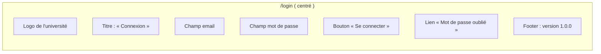

# Étape 7 — UX / UI

Spécifications d'expérience utilisateur et maquettes d'écrans, dashboards et composants clés.

## 7.1 Principes de design

| Principe | Application |
|---|---|
| **Simplicité** | 3 clics max du logisticien entre la recherche et l'encaissement. |
| **Feedback immédiat** | Scan → son + bandeau vert en 200 ms. Erreur → bandeau rouge + texte clair. |
| **Mobile-first** | L'étudiant utilise souvent son smartphone ; le guichet sur poste fixe. |
| **Accessibilité** | Contraste AA, focus visible, navigation clavier, textes lisible (16 px minimum). |
| **Cache** | `no-store` partout : l'information de statut serafraîch toujours en temps réel. |
| **Micro-interactions** | Hover sur les boutons, Lottie pour l'indicateur de scan. |
| **Thème clair** | Couleurs sobres : gris `#F5F5F5`, bleu `#1976D2`, vert `#388E3C` (valid), rouge `#D32F2F` (erreur). |

## 7.2 Écrans (wireframes)

### 7.2.1 Page de connexion (`/login`)



- `L3` et `L4` avec icône à l'intérieur.
- Après soumission : skeleton `auth-loading` pendant la vérification.
- Erreur : `Email ou mot de passe invalide` (message unique, ne révèle pas le champ erroné).

---

### 7.2.2 Espace étudiant — Tableau de bord (`/(etudiant)/tableau-de-bord`)

**Objectif** : voir rapidement ses réservations et tickets récents.

```
┌────────────────────────────────────────────┐
│  Logo université   Menu ≡     │  Déconnexion│
│────────────────────────────────────────────│
│  Bonjour, Awa !                          │
│                                            │
│  ┌─────────────────────────────┐ ┌───────┐ │
│  │  Réservations actives        │ │Ticket│ │
│  │  3                           │ │  8    │ │
│  │  Total : 6 300 FCFA            │ │ en attente │
│  └─────────────────────────────┘ └───────┘ │
│                                            │
│  Réservations récentes                    │
│  ┌─────────────────────────────────────┐  │
│  │ Déjeuner – 10 portions            │  │
│  │ Référence : RES-2026-000137         │  │
│  │ Total : 4 000 FCFA  |  Payé : 09/10 │  │
│  │                             [Voir]  │  │
│  └─────────────────────────────────────┘  │
│                                            │
│  Vos tickets (8)                           │
│  TKT-2026-000410 ─ Dîner  [PDF] [QR] [Impr.]│
│  TKT-2026-000409 ─ Déj.   [PDF] [QR] [Impr.]│
│                                            │
│  ┌────────────────────┐                  │
│  │ Réserver          ►│ (bouton bleu)    │
│  └────────────────────┘                  │
└────────────────────────────────────────────┘
```

Actions rapides : 
- **Réserver** : bouton fixe en bas de page (mobile) ou à droite.
- Chaque ticket a : statut (icône `✅`, `⏳`, `⚠️`), boutons `PDF`, `QR`, `Imprimer`.
- Trier par `statut`, `date`, `type de repas`.

---

### 7.2.3 Réservation (`/(etudiant)/reserver`)

Écran en deux colonnes (ou glissé vers le bas en mobile) :

```
┌───────────────────────────────┬──────────────┐
│  Repas                         │ Résumé       │
│  ┌──────────┬───────┬────────┐ │              │
│  │ ☑ Déj.   │ ☑ Dî. │  Petit-déj.│ │ 1 Déjeuner   │
│  │ 10 × 400│ 5 × 350│ 2 × 150 │ │ 10 × 400    │
│  │ 4 000  │ 1 750 │ 300   │ │ 5 Dîner    │
│  └──────────┴───────┴────────┘ │ 10 Déj.    │
│                                 │ 2 P.Dj.    │
│  Quantité  [1▼]                │              │
│  Prix : 400,00 FCFA            │ Total : 6 300 FCFA│
│  [ + Ajouter un repas ]         │              │
│                                 │ [ Confirmer ]│
│  Note : ________________________ │              │
└───────────────────────────────┴──────────────┘
```

- **Pas de champ quantité + à choisir**. L'étudiant sélectionne le repas → un modal mini s'ouvre avec `Stepper` quantité (1–99). 
- `Total` est en gras, `FCFA` ajouté par le composant `MoneyDisplay`.
- Le bouton **Confirmer** est désactivé tant que aucun repas choisi.
- En cas d'erreur serveur, toast rouge avec message exact.

---

### 7.2.4 Confirmation de paiement (`GET /reservations/mine/[id]` → onglet Paiement)

```
┌────────────────────────────────────────────┐
│  Réservation #RES-2026-000137            │
│                                            │
│  ┌─────────────────────────────────────┐   │
│  │  Déjeuner  │ 10 × 400 = 4 000 FCFA  │   │
│  │  Dîner     │ 5 × 350 = 1 750 FCFA   │   │
│  │  Petit-déj.│ 2 × 150 = 300 FCFA     │   │
│  └─────────────────────────────────────┘   │
│                                            │
│  TOTAL à encaisser : 6 300 FCFA          │
│                                            │
│  Cash reçu : [ 6 500 ]  FCFA              │
│  Monnaie rendue : [ 200 ]  FCFA           │
│                                            │
│  [ Confirmer le paiement ]  (gris → bleu) │
│                                            │
│  ┌─────────────────────────────────────┐   │
│  │ 2 tickets seront générés           │   │
│ │  → 10 déjeuners + 5 dîners + 2 p.dj. (17 tickets) │
│  └─────────────────────────────────────┘   │
└────────────────────────────────────────────┘
```

Le résumé récapitule le nombre total de tickets qui seront générés (règle 7). Le bouton devient actif après saisie du cash. Un toast indique « Paiement enregistré, les tickets sont prêts » puis redirige vers la liste des tickets.

---

### 7.2.5 Scanner (`/guichet/scanner`)

Le logisticien scanne les tickets au guichet.

```
┌────────────────────────────────────────────┐
│  Scanner de tickets                       │
│────────────────────────────────────────────│
│                                            │
│  ┌─────────────────────────────────────┐   │
│  │          Caméra (rapprochée)         │   │
│  │   ⟨ QR code scannable en direct ⟩    │   │
│  └─────────────────────────────────────┘   │
│                                            │
│  ┌─────────────────────────────────────┐   │
│  │  Ou saisir manuellement le numéro   │   │
│  │  TKT-2026-000412 ______________  ▶   │   │
│  └─────────────────────────────────────┘   │
│                                            │
│  ┌─────────────────────────────────────┐   │
│  │  Étudiant : Awa Traoré              │   │
│  │  Repas : Déjeuner                  │   │
│  │  Statut : UTILISÉ le 09/10 à 12:14 │   │
│  │  [ Imprimer reçu caché ]           │   │
│  └─────────────────────────────────────┘   │
└────────────────────────────────────────────┘
```

- **Retour visuel** : étudiant trouvé + statut.
- **Option « Imprimer reçu caché »** : petit bouton pour imprimer un reçu papier si l'étudiant le demande (optionnel, back-office).
- Après scan, **focus** redirigé vers le champ de saisie pour le ticket suivant.
- **Audio** : `success.mp3` (bip court) ou `error.mp3` (tir répétitif).

---

### 7.2.6 File d'attente (`/(guichet)/encaisser`)

 vue principale du guichet.

```
┌────────────────────────────────────────────┐
│  File d'attente (prêts < 2 min)           │
│────────────────────────────────────────────│
│  ℹ 3 élements attendus                   │
│                                            │
│  ┌─────────────────────────────────────┐   │
│  │  ⏱ 1 min                             │   │
│  │  Étudiant : Awa Traoré                │   │
│  │  Repas : 10 déjeuners + 5 dîners      │   │
│  │  Total : 6 300 FCFA                    │   │
│  │  ┌─────────────┐                      │   │
│  │  │ Encaisser ▶│                       │   │
│  │  └─────────────┘                      │   │
│  └─────────────────────────────────────┘   │
│                                            │
│  ┌─────────────────────────────────────┐   │
│  │  ℹ 3 min                            │   │
│  │  Étudiant : Ibrahim K.               │   │
│  │  Déjeuner : 5 portions               │   │
│  │  Total : 2 000 FCFA                 │   │
│  │  [Encaisser]                         │   │
│  └─────────────────────────────────────┘   │
│                                            │
│  ──────────────────────────────────────   │
│                                            │
│  [ Rafraîchir ]  (auto-rafraîchissement s) │
└────────────────────────────────────────────┘
```

- Chronomètre `⏱` = temps depuis création.
- Tri par `created_at` ASC, puis par `items_count` DESC.
- Clic sur **Encaisser** ouvre un modal d'encaissement avec le même écran que 7.2.4.

---

### 7.2.7 Espace admin — Tarifs (`/(admin)/tarifs`)

```
┌────────────────────────────────────────────┐
│  Tarifs des repas (valide jusqu'au 30/11)  │
│────────────────────────────────────────────│
│                                            │
│  Repas           | Prix actuel | Historique │
│  ────────────────────────────────────────── │
│  Petit-déj.     | 150 FCFA     | ● Historique│
│  Déjeuner       | 400 FCFA     | ● Historique│
│  Dîner          | 350 FCFA     | ● Historique│
│                                            │
│  [ Nouveau prix ]                           │
│                                            │
│  ┌─────────────────────────────────────┐   │
│  │  Mettre à jour le prix du déjeuner │   │
│  │  Nouveau montant : [ 450 ] FCFA    │   │
│  │  Date de prise d'effet : [11/10/2026]│   │
│  │  Motif : Révision tarifaire hiver  │   │
│  │                                     │   │
│  │  [ Annuler ]    [ Enregistrer ]    │   │
│  └─────────────────────────────────────┘   │
└────────────────────────────────────────────┘
```

- Le prix historisé ne modifie jamais le passé.
- Le bouton **Mettre à jour** clone une ligne dans `meal_prices` avec `effective_from` changé et le précédent `effective_to` clos.
- Confirmation avant changement.
- Après « Enregistrer » → toast vert « Nouveau tarif en vigueur le 11/10/2026 » + invalidation du cache tarifs.

---

### 7.2.8 Signature / Cachet (`/(admin)/reglages`)

```
┌────────────────────────────────────────────┐
│  Paramètres de génération de PDF          │
│────────────────────────────────────────────│
│                                            │
│  ╔════════════════════════════════════╗   │
│  ║  Signature                        X  ║   │
│  ║  Image: upload PNG/JPG, max 2 Mo   ║   │
│  ╚════════════════════════════════════╝   │
│                                            │
│  ╔════════════════════════════════════╗   │
│  ║  Cachet université              X  ║   │
│  ║  Image: upload PNG/JPG, max 2 Mo   ║   │
│  ╚════════════════════════════════════╝   │
│                                            │
│  Validité d'un ticket : [ 30 ] jours     │
│                                            │
│  [ Sauvegarder les paramètres ]           │
└────────────────────────────────────────────┘
```

- Drag-and-drop ou bouton `Choisir`.
- Mini-prévisualisation du rendu (overlay sur un ticket type).
- Le PDF généré merge ces images en haut à droite et au bas à gauche.

---

### 7.2.9 Tableau de bord logisticien (`/(guichet)/tableau-de-bord`)

```
┌────────────────────────────────────────────┐
│  Tableau de bord — 09/10/2026 09:30         │
│────────────────────────────────────────────│
│                                            │
│  ┌───────┬────────┬────────┬───────┬─────┐│
│  │ Réserv.│Payé    │ Encaiss.│ Tickets│ Exp.││
│  │  48    │  45    │   12    │  41   │  3  ││
│  └───────┴────────┴────────┴───────┴─────┘│
│  Total CA : 247 500 FCFA                   │
│                                            │
│  CA du jour : 45 000 FCFA (12 réservations)│
│                                            │
│  Évolution des ventes                        │
│  Dessin en ligne : [graphique]            │
│  - Déjeuner : 32 tickets vendus            │
│  - Dîner : 25 tickets vendus               │
│                                            │
│  [ Voir le rapport complet PDF ]           │
└────────────────────────────────────────────┘
```

- KPI sous forme de **cards** avec icônes et gradient de couleur.
- Graphique `line` (Tailwind Charts ou Chart.js en composant React).
- Export PDF téléchargeable via `/reports/export`.

---

## 7.3 Composants UI (catalogue)

| Nom | Usage | Couleurs |
|---|---|---|
| `Button` | Tous boutons | `primary` bleu, `destructive` rouge, `secondary` gris |
| `Card` | Encadrants | ombre légère `shadow` |
| `Input` | Champs texte | bordure `#CCC` focus `#1976D2` |
| `Select` | Menus déroulants | flèche `?`, cliquable sur mobile |
| `Dialog` | Modals | arrière-plan noir 50% opacité |
| `Tabs` | Onglets | underline bleu active |
| `Badge` | Statuts | `bg-green-100 text-green-800` (USED), `bg-yellow-100` (PENDING), `bg-gray-100` (GENERATED), `bg-red-100` (EXPIRED) |
| `Skeleton` | Loaders | `animate-pulse` |
| `Toast` | Feedback | `success` vert, `error` rouge, `info` bleu |
| `Tooltip` | Infos surImages | `hover` uniquement (mobile) |
| `QrCode` | Affichage QR | fond blanc, size 200×200 px minimum |
| `ScannerView` | Caméra | plein écran en fullscreen overlay |
| `MoneyDisplay` | Format FCFA | `6 300 FCFA` avec espace insécable |
| `StatusTimer` | Compte à rebours validité | `02:31:15` rouge quand ≤ 5 min |

---

## 7.4 Dark mode (optionnel)

Thème configurable. Le logo et le fonds sont en pixels gris, donc adaptés aux deux modes. Couleurs :

```css
:root {
  --background: 210 20% 98%;
  --foreground: 210 10% 20%;
}
.dark {
  --background: 210 12% 6%;
  --foreground: 0 0% 93.5%;
}
```

Les tickets PDF gardent un fond blanc (impression).

---

## 7.5 Règles d'interaction

| Interaction | Déclencheur | Animation |
|---|---|---|
| Tap bouton **Encaisser** | `pointerdown` | `scale(0.98)` 100 ms, puis loader spinner |
| Scan QR valide | lecture code | Fade → étudiant trouvé |
| Erreur scan | QR invalide | Shaker du cadre + flash rouge |
| Double scan ticket | statut `USED` | Bandeau rouge + icône `X` + `error.mp3` |
| Hover card | clavier focus ou souris | `shadow-lg` + `translate-y(-2px)` |
| Swipe réservations | `use swipe` (mobile) | Déplacement horizontal → détaillé |

---

## 7.6 Accessibilité

1. **ARIA live regions** : les toasts et les résultats de scan sont annoncés (`aria-live="assertive"`).
2. **Focus management** : après un modal, focus sur le premier champ. Fermer avec `Esc`.
3. **Navigation clavier** : `Tab` ordonne logiquement, `Shift+Tab` inverse.
4. **Contraste** : texte sur fond `#1976D2` → ratio ≥ 4.5 : 1 (AA).
5. **Étiquettes** : `label` associé au `id` de chaque champ de formulaire.
6. **Touch targets** : 44×44 px minimum, marges de 8 px entre les éléments.

---

## 7.7 Points d'attention graphique

1. **Polices** : `Inter` ou `Source Sans Pro`. `font-sans`. H1 24 px, H2 20 px, corps 16 px.
2. **Espacement** : 8 px (base config Tailwind `spacing`).
3. **Boutons** : hauteur 40 px, padding horizontal 24 px.
4. **Tickets** : marge intérieure 16 px, bordure arrondie 8 px.
5. **Impression** : `@media print` masque le header, le footer est ajouté automatiquement par le PDF.

---

## 7.8 Questions à valider avant l'étape 8

1. Le scan doit-il afficher un **historique des scans** sur le ticket (date/heure, opérateur) dans le PDF côté serveur ?
2. Faut-il une **touche raccourie clavier** pour valider le paiement (`Enter` sur le cash) ?
3. L'admin doit-il pouvoir **forcer la réimpression** d'un ticket perdu (endpoint dédié) ?
4. Le thème **sombre** est-il réellement utilisé sur le site de l'université ?