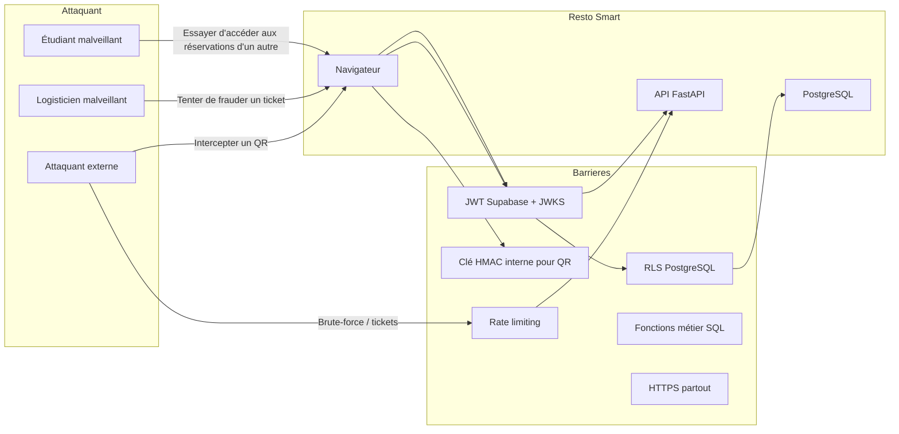

# Étape 8 — Sécurité

Protection des données, des opérations sensibles et des modes d'accès.

## 8.1 Schéma de menace



| Attaque | Contre-mesure |
|---|---|
| Accès non autorisé aux données d'un autre étudiant | JWT valide → RLS filtre par `student_id` |
| Tenter de confirmer un paiement sans être logisticien | Dépendance `/confirm-payment` → `require_staff()` + trigger `PAYMENT_CONFIRM_FORBIDDEN` |
| Scander un QR falsifié | Vérification HMAC `QR_INVALID`, 401 |
| Double-scan pour profiter d'un all-you-can-eat | `select ... for update` dans `fn_consume_ticket`, état `USED` est définitif |
| Modifier un ticket `GENERATED → USED` en dehors du scan | Trigger `fn_guard_ticket_update` → `TICKET_CONSUME_FORBIDDEN` sauf via fonction interne |
| Insérer un prix qui chevauche | Contrainte exclusion `meal_prices_no_overlap_excl` (bâton) |
| Accès à la base sans passer par l'API | RLS sur toutes les tables, clé anonyme ne peut rien faire ; `service_role` uniquement dans le backend |
| Fuite de QR entre le scan et la validation | QR signé avec timestamp valide 30 jours, mais `qr_payload` est unique, donc un QR réclamé = un ticket réclamé. Risque minime car le backend valide le HMAC avant consommation. |
| Aucune trace de paiement | `audit_logs` immuable, trigger empêche update/delete |

---

## 8.2 Authentification

### JWT Supabase Auth

- Utilise **Supabase Auth** (fourni avec Supabase).
- Id Token conforme à OpenID Connect.
- Clé publique récupérée via `/.well-known/jwks.json` (cachable 1h).
- Vérification côté serveur dans `auth_service.verify_jwt()` :
  - `exp` (expiration, min 5 min).
  - `aud` = `authenticated`.
  - `iss` contrôlé.
- **Refresh token** : accédé via `supabase.auth.refreshSession()` ; le frontend fait cela en silence.

### Raffraissement de session

- Supabase SSR (`@supabase/ssr`) gère automatiquement le rafraîchissement grâce aux cookies `refresh_token`.
- Le cookie `supabase-auth-token` (access token) est HttpOnly, SameSite = `Lax`, Secure.
- Aucun stockage en `localStorage` (évite le vol de session XSS).

### Service Role

- Le backend utilise la variable d'environnement `SUPABASE_SERVICE_ROLE_KEY`.
- Cette clé **n'existe jamais côté client**.
- Elle permet de contourner la RLS uniquement dans les opérations critiques (création de tickets, PDF, etc.).

---

## 8.3 Signatures, QR codes et anti-fraude

### HMAC sur le QR Code (règle 8)

```
payload = "TKT-2026-000412.1.<16 chars HMAC>"
```

- `1` = version de la clé (prévoit la rotation).
- HMAC = `sha256(secret, ticket_number)[:16]`.
- La clé secrète est stockée comme `SECRET` dans les environnements Railway/Render / Vercel.
- La base **n'a jamais besoin de connaître la clé** : elle ne voit que le `ticket_number` stocké dans `qr_payload`.

### Vérification côté backend

```python
def verify(self, payload: str) -> str | None:
    try:
        number, version, mac = payload.rsplit(".", 2)
    except ValueError:
        return None
    if int(version) != self.settings.qr_secret_version:
        return None
    expected = self._sign_internal(number).split(".")[-1]
    if not hmac.compare_digest(mac, expected):
        return None
    return number
```

`hmac.compare_digest` empêche les attaques de timing.

### Rotation des clés

- Variable `QR_SECRET_VERSION` dans les secrets.
- À changer une fois par an ou après un incident.
- Les tickets déjà générés conservent leur version (stockée dans le QR).
- Fonction `fn_reset_number_sequences` peut être étendue pour marquer obsolète`.

---

## 8.4 Stockage des fichiers

### Bucket `tickets`

```sql
create bucket
  id                 = 'tickets'
  public             = false
  file_size_limit    = 10 MB
  allowed_mime       = ['application/pdf', 'image/png']
```

### Politiques Storage

```sql
create policy "tickets_storage_select" on storage.objects
  for select to authenticated
  using (bucket_id = 'tickets' and (owner = auth.uid() or public.is_staff()));
```

- Un étudiant ne voit que les fichiers qu'il a téléchargés (`pdf/<student_id>/…`).
- Les PDF sont **signés temporairement** (`POST /tickets/{id}/pdf`) → URL valide 5 minutes, jamais de lien permanent dans l'interface.
- **Expiration** : un cron (ou client) supprime les fichiers de tickets `GENERATED` dont le `valid_until` est dépassé. Facultatif car l'incertitude est faible.

### Signature / Cachet

- Uploadés par l'admin via `POST /settings/signature`.
- Stockés sous `images/signature.png`, `images/cachet.png`.
- Intégrés dans chaque ticket PDF — signature et cachet superposés en haut à droite / bas à gauche.

---

## 8.5 Anti-fraude / Intégrité

| Élément | Moyen |
|---|---|
| Montant déclaratif | **Jamais** envoyé par l'étudiant ; le backend lit les prix et calcule (`fn_confirm_payment`). |
| Statuts réservations | Contrainte `CHECK` + trigger `fn_guard_reservation_update`. |
| Double paiement | Idempotence : deux appels `fn_confirm_payment` → `already_confirmed = true`. |
| Double consommation | `select for update` + `TICKET_ALREADY_USED` 409. |
| Vol de session | JWT HttpOnly, rafraîchissement automatique, 15 min d'inactivité → logout. |
| Accès admin accéléré | `is_admin()` vérifie le rôle dans `profiles`, pas dans le JWT. |
| Rapprochement caisse | `cash_received` et `change_given` enregistrés, exportable. |

---

## 8.6 Rate limiting (entrée des données)

Via `slowapi` (FastAPI) ou un reverse proxy (Vercel Edge).

| Endpoint | Limite | Message d'erreur |
|---|---|---|
| `POST /reservations` | 5/min par utilisateur | 429 TROP_DE_REQUETES |
| `POST /tickets/consume` | 30/min par adresse IP | 429 SCAN_TROP_RAPIDE |
| `POST /auth` | 3/min par IP | 429 TOO_BIO |
| Tous les GET | 120/min par utilisateur | 429 |

Un `Retry-After` est renvoyé en cas d'erreur 429.

---

## 8.7 Journalisation & audit

### Audit logs (règle 10)

Chacune des actions sensibles génère une ligne dans `audit_logs` :

```json
{
  "id": 4821,
  "actor_id": "3b7e…",
  "action": "payment.confirm",
  "entity_type": "reservation",
  "entity_id": "RES-2026-000137",
  "outcome": "SUCCESS",
  "metadata": { "total_amount": "6300.00", "ticket_count": 17, "student_id": "8f1c…" },
  "ip": "41.196.xxx.xxx",
  "created_at": "2026-10-09T09:22:11Z"
}
```

- Tableau de bord admin → export CSV.
- Rien n'est jamais modifiable → `trigger audit_logs_no_update/delete` + `REVOKE update, delete`.
- Les logs conservent **l'acteur** même si le profil est désactivé.

### Logs d'accès

```json
{
  "ts": "2026-10-09T09:22:10.123Z",
  "request_id": "req_01HT...",
  "method": "POST",
  "path": "/api/v1/reservations/REZ-2026-000137/confirm-payment",
  "actor": { "id": "3b7e…", "role": "logistician", "ip": "41.196.xxx.xxx" },
  "status": 200,
  "duration_ms": 87,
  "size": 3412
}
```

Les logs sont répartis sur plusieurs systèmes :

| Élément | Où | Rétention |
|---|---|---|
| `access.log` FastAPI | stdout (Railway/Render) | 30 jours |
| `audit_logs` PostgreSQL | dans la BDD | 5 ans (conservation légale) |
| `structlog` | CloudWatch ou Papertrail | 30 jours |

---

## 8.8 HTTPS & TLS

- Toutes les communications passent par **HTTPS**.
- Certificat **Let's Encrypt** géré automatiquement par Vercel (frontend) et Railway (backend).
- HSTS : `strict-transport-security: max-age=31536000; includeSubDomains` sur tous les nœuds.
- Cookies `Secure` et `HttpOnly`.
- Cors : `allow_origins` listée dans `config.ts` uniquement (localhost, domaine de prod).

---

## 8.9 Secrets & Variables d'environnement

| Secret | Backend | Frontend | Notes |
|---|---|---|---|
| `SUPABASE_URL` | ✅ | ✅ (NEXT_PUBLIC) | Public |
| `SUPABASE_ANON_KEY` | ✅ | ✅ (NEXT_PUBLIC) | Autorisé anonyme, RLS protège |
| `SUPABASE_SERVICE_ROLE_KEY` | ✅ | ❌ | **Jamais** dans le bundle client |
| `QR_SECRET` | ✅ | ❌ | HMAC secret pour signature QR |
| `SMTP_PASSWORD` (optionnel mail) | ✅ | ❌ | Pour réinitialisation mots de passe |
| `ENCRYPTION_KEY` (chiffrement cookies) | ✅ | ❌ | Si on ajoute du chiffrement côté serveur |

Les fichiers `.env*` sont gitignorés. Le déploiement CI utilise les **secrets** de la plateforme.

---

## 8.10 Sécurité du frontend

### Protection XSS

- React échappe automatiquement avec `dangerouslySetInnerHTML` uniquement lorsque le HTML est injecté from **trusted source** (templates serveur).
- Les URL de PDF sont signées, donc **aucun flux cross-origin** possible en attaquant.

### Navigation

- `redirect: true` sur `authenticate` empêche le **open redirect**.
- Les paramètres `next=` sont validés (`new URL()`, protocole `https:` ou `http://localhost`).

### CSP (à ajouter)

```http
Content-Security-Policy: default-src 'self'; script-src 'self' 'unsafe-inline'; style-src 'self' 'unsafe-inline'; img-src 'self' data:; connect-src 'self' https://<projet>.supabase.co; frame-src 'self'; manifest-src 'self'; base-uri 'self'; form-action 'self';
```

Note : `unsafe-inline` est temporaire pour le hackathon. À remplacer par `sha256-...` en prod.

---

## 8.11 Tests de sécurité (automatisés)

Intégrés dans le pipeline CI (GitHub Actions ou GitLab CI).

| Test | Outil | Fréquence |
|---|---|---|
| Scan dépendances vulnérables | `pip-audit` (backend), `npm audit` (frontend) | chaque push |
| Analyse statique Python | `bandit` | chaque push |
| Analyse statique TypeScript | `eslint-plugin-security` | chaque push |
| Scan vulnérabilités SSRF | `semgrep` | chaque merge |
| Test injection SQL | `sqlmap` sur endpoints GET avec paramètres | régulier |
| Scan mots de passe faibles | `cracklib` | lors de l'import des comptes |

---

## 8.12 Checklist sécurité avant mise en production

- [ ] Les clés `SUPABASE_SERVICE_ROLE_KEY` et `QR_SECRET` sont configurées comme **secrets** (pas env).
- [ ] Les PDFs générés ne contiennent pas d'informations non intentionnelles (matricule étudiant, nom).
- [ ] Le bucket Storage `tickets` est privé (public = false).
- [ ] Les URL-signées ont une durée courte (5 minutes).
- [ ] La base de données a les extensions `pgcrypto`, `btree_gist` activées.
- [ ] Les politiques RLS sont actives (`is_row_level_security = true` sur toutes les tables).
- [ ] Les fonctions sensibles sont `SECURITY DEFINER` (propriétaire `postgres`).
- [ ] Aucun mot de passe n'est présent dans le code (`git grep -i password` = vide).
- [ ] Les logs d'accès ne contiennent pas de données sensibles (pas de QR brut en clear text).
- [ ] La solution CSP est activée.
- [ ] HSTS + certificat valide en prod.
- [ ] Le cron `expire_tickets` est programmé (Vercel Cron ou Railway Scheduler).
- [ ] Le cron `reset_number_sequences` est programmé le 1er janvier.

---

## 8.13 Questions de sécurité à valider

1. Faut-il **chiffrer** les certains champs (ex. `matricule` dans le QR ?). Actuellement le QR est public une fois généré.
2. Le backend doit-il garder une **trace de chaque PDF généré** (hash SHA256) dans une colonne `pdf_hash` ?
3. Un **rate limiter global** ouvert sur le scannage du guichet est-il suffisant ?
4. Qui a **accès aux logs d'audit** ? Un événement de sécurité doit-il être notifié par email ?